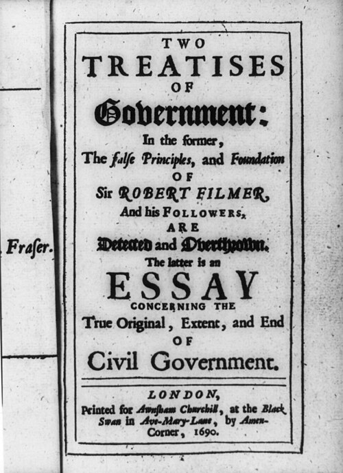

In February 1689 **[John Locke](kloom:e/john-locke)** came home from five years of exile in the Dutch Republic, in the wake of the revolution that put William of Orange on the English throne. Within a year three of his books were in print. Two of them carried no author's name. The **[_Two Treatises of Government_](kloom:e/two-treatises-of-government)** appeared in December 1689, its title page dated 1690, "printed for Awnsham Churchill" in London. Its preface said it was meant "to establish the throne of our great restorer, our present King William; to make good his title, in the consent of the people". The revolution itself has its own frame, the Glorious Revolution.

The preface misled readers for more than two centuries. In 1956, and then in his Cambridge edition of the text, the historian Peter Laslett showed that most of the book had been written ten years earlier, during the **[Exclusion Crisis](kloom:e/exclusion-crisis)** of 1679–1681, when Locke's patron **[Anthony Ashley Cooper, 1st Earl of Shaftesbury](kloom:e/anthony-ashley-cooper-1st-earl-of-shaftesbury)**, led the campaign to bar the king's Catholic brother James from the succession. Scholars now hold that it may have been meant to justify an armed rising. David Armitage dates the chapter on property to the summer of 1682. It was a book written for a revolution that failed, and published for one that succeeded.

Locke was no lawyer. He was a physician and an experimental philosopher, who had worked with **[Robert Boyle](kloom:e/robert-boyle)** at Oxford and was elected to the **[Royal Society](kloom:e/royal-society)** in 1668. In exile he read **[Isaac Newton](kloom:e/isaac-newton)**'s _Principia_ and asked Christiaan Huygens whether its mathematics could be trusted. In his **[_Essay Concerning Human Understanding_](kloom:e/an-essay-concerning-human-understanding)**, the third book of 1689, he called himself an "under-labourer", clearing the ground for "the incomparable Mr. Newton".

## How the argument runs

The first treatise demolishes **[Robert Filmer](kloom:e/robert-filmer)**, who had derived the power of kings from Adam's. The second builds a government from nothing, in steps. In the text of the 1764 edition:

| Step            | Locke's words                                                                                                                            | §   |
| --------------- | ---------------------------------------------------------------------------------------------------------------------------------------- | --- |
| State of nature | "a state of perfect freedom", but "not a state of licence": "no one ought to harm another in his life, health, liberty, or possessions"  | 4–6 |
| Property        | "every man has a property in his own person"; what he takes from nature "he hath mixed his labour with", and made his own                | 27  |
| Why leave it    | the state of nature is "very unsafe, very unsecure", so men unite "for the mutual preservation of their lives, liberties and estates"    | 123 |
| Consent         | "no one can be put out of this estate, and subjected to the political power of another, without his own consent"                         | 95  |
| Trust           | the legislature is "only a fiduciary power to act for certain ends"                                                                      | 149 |
| Resistance      | a legislature that grasps "an absolute power over the lives, liberties, and estates of the people" forfeits it "by this breach of trust" | 222 |

Two things in the table are easy to miss. "Property", for Locke, means life and liberty as well as land. And the labor that makes land property was a colonist's test. "In the beginning all the world was America," he wrote: land that no one tilled was there for the taking, which, as the historians James Tully and Barbara Arneil point out, left Native Americans owning their game but not their hunting grounds.

## Toleration, within limits

The **[_Letter Concerning Toleration_](kloom:e/a-letter-concerning-toleration)**, written in Latin in the winter of 1685–86 and printed in English in 1689 in William Popple's translation, applies the same reasoning to religion. The commonwealth exists only for "civil interests", "life, liberty, health, and indolency of body" and outward possessions, and force cannot make anyone believe. "Neither Pagan nor Mahometan, nor Jew, ought to be excluded from the civil rights of the commonwealth because of his religion."

Two exceptions follow. No toleration for a church whose members "deliver themselves up to the protection and service of another prince", which historians have long read as Catholics and the pope; Mark Goldie and John Marshall argue that Locke would have tolerated Catholics who gave up that allegiance. And none for atheists: "those are not at all to be tolerated who deny the being of a God", since oaths "can have no hold upon an atheist".

## Locke and slavery

The first treatise opens: "Slavery is so vile and miserable an estate of man... that it is hardly to be conceived, that an Englishman, much less a gentleman, should plead for it." The second allows it only for a captive taken in a just war. Yet Locke served Shaftesbury as secretary when the proprietors of Carolina adopted the **[Fundamental Constitutions of Carolina](kloom:e/fundamental-constitutions-of-carolina)** in 1669, whose article 110 reads: "Every freeman of Carolina shall have absolute power and authority over his negro slaves, of what opinion or religion soever." He is named among the subscribers in the 1672 charter of the **[Royal African Company](kloom:e/royal-african-company)**, which held England's monopoly of the African trade, slaves included. Between 1672 and 1731 its ships carried some 187,000 enslaved Africans to the English colonies, and about 16,000 died on the way.

Historians read this differently. Armitage finds Locke revising the Constitutions in 1682, while he wrote on property. James Farr argues that his theory of slavery was aimed at Stuart absolutism, not at the Americas, while conceding that Locke's reputation as liberty's champion "would not survive the contradictions" slavery ensnared him in. Holly Brewer argues that his part in the Constitutions was a paid secretary's, that he was paid in the company's stock and sold it, and that on the Board of Trade in the 1690s he worked to undermine slavery in Virginia.

## Onward

The book was little read at first: of some 200 tracts on the Revolution published between 1689 and 1694, three mention Locke. It rose in the eighteenth century, and colonists quoted it against the Stamp Act in 1765. Section 225 warns that a people will rise when "a long train of abuses" makes a design of tyranny plain, and the phrase reappears in the Declaration of Independence. The next frame turns to Paris, where the philosophes set out to gather all that was known into one work.
