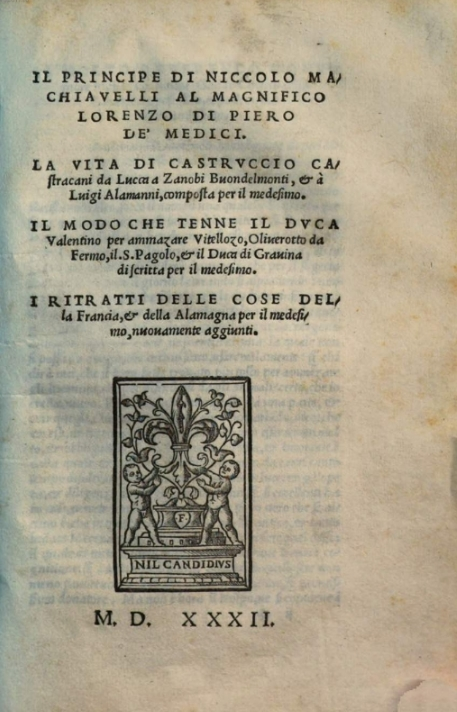

In 1498, shortly after the friar Savonarola was executed, the **[Republic of Florence](kloom:e/republic-of-florence)** made a twenty-nine-year-old with no experience of law or office secretary of its Second Chancery. For fourteen years **[Niccolò Machiavelli](kloom:e/niccolo-machiavelli)** wrote the republic's letters, rode on its embassies to the king of France, the emperor and the pope, raised a citizen militia to replace its hired soldiers, and watched the powerful at work. In August 1512 Spanish troops backing Pope Julius II and the Medici routed the militia at Prato, the republic fell, and the **[House of Medici](kloom:e/house-of-medici)**, exiled since 1494, came back. Machiavelli was dismissed in November. Early in 1513 his name turned up on a list of possible sympathizers kept by conspirators against the Medici. He was arrested and given several drops of the strappado, hoisted by his wrists bound behind him, and he confessed to nothing. When Cardinal Giovanni de' Medici became **[Pope Leo X](kloom:e/pope-leo-x)** in March, an amnesty set him free, and he went to his small farm near San Casciano.

On 10 December 1513 he described his days there to his friend **[Francesco Vettori](kloom:e/francesco-vettori)**. (W. K. Marriott, whose translation of 1908 is quoted throughout, dated the letter the 13th.) He described his days with his family and his neighbors, and then:

> The evening being come, I return home and go to my study; at the entrance I pull off my peasant-clothes, covered with dust and dirt, and put on my noble court dress, and thus becomingly re-clothed I pass into the ancient courts of the men of old, where, being lovingly received by them, I am fed with that food which is mine alone; where I do not hesitate to speak with them, and to ask for the reason of their actions, and they in their benignity answer me.

From those conversations, he wrote, he had "composed a small work on 'Principalities'". It is **[The Prince](kloom:e/the-prince)**.

## How it argues

_The Prince_ argues the way a chancery secretary briefs a government: it sorts the cases, then sets an ancient example beside a modern one and draws a rule. Chapter I is a tree, which the plate draws. The rest follows from where a ruler stands on it:

| Chapter | The rule, in Marriott's English                                                                                                                                                   |
| ------- | --------------------------------------------------------------------------------------------------------------------------------------------------------------------------------- |
| I       | "All states, all powers, that have held and hold rule over men have been and are either republics or principalities."                                                             |
| XII     | "Mercenaries and auxiliaries are useless and dangerous", for "they have no other attraction or reason for keeping the field than a trifle of stipend"                             |
| XVII    | "one should wish to be both, but, because it is difficult to unite them in one person, it is much safer to be feared than loved, when, of the two, either must be dispensed with" |
| XVIII   | "it is necessary to be a fox to discover the snares and a lion to terrify the wolves"                                                                                             |
| XXV     | "Fortune is the arbiter of one-half of our actions, but that she still leaves us to direct the other half, or perhaps a little less"                                              |

The chapter on the fox and the lion begins by answering **[Cicero](kloom:e/cicero)**. Marriott's notes trace the passage to Cicero's _On Duties_, which held, in our translation, that there are two ways of contending, by argument and by force, "the first proper to man, the second to beasts", and that force is the last resort. Machiavelli tells the prince to learn both beasts. Against fortune, which he likens to a river in flood that can be held only by dykes built in fair weather, he sets _virtù_, which Marriott renders "ability": what a ruler brings of his own to meet his chance.

His model was **[Cesare Borgia](kloom:e/cesare-borgia)**, son of **[Pope Alexander VI](kloom:e/pope-alexander-vi)**, who carved a state out of the Romagna between 1499 and 1503. Machiavelli, on the republic's business, saw him seize his rebellious captains at Senigallia on 31 December 1502 and have them strangled. When the duke had made his governor, Ramiro d'Orco, do the cruel work of pacifying the province, he had him "executed and left on the piazza at Cesena with the block and a bloody knife at his side." Machiavelli wrote: "I do not know what better precepts to give a new prince than the example of his actions". Borgia's state collapsed when his father died, which _The Prince_ calls "the extraordinary and extreme malignity of fortune."

## The republican

Machiavelli also wrote, around 1517, the **[_Discourses on Livy_](kloom:e/discourses-on-livy)**, a long commentary on **[Livy](kloom:e/livy)**'s history of the Roman republic. There he argues, in Ninian Hill Thomson's translation of 1883, that "a people is more prudent, more stable, and of better judgment than a prince." Scholars disagree about how the two books fit. Hans Baron argued that Machiavelli changed his mind in favor of free republics after _The Prince_. Harvey Mansfield and Nathan Tarcov read them as a pair written at much the same time, and William Connell traces _The Prince_ being revised from 1513 to 1515.

## The reputation

_The Prince_ was dedicated at last to Lorenzo di Piero de' Medici, and nothing shows that he read it. It was printed in 1532, five years after Machiavelli died, with the permission of a Medici pope, Clement VII. About fifteen editions were in circulation when Pope Paul IV put Machiavelli's works on the **[Index of Forbidden Books](kloom:e/index-librorum-prohibitorum)** in 1559. "Machiavellianism" entered English in 1607, and the stage Machiavel became a byword for the schemer. Others read him differently. Francis Bacon thanked writers who "declare or describe what men do, and not what they ought to do". **[Jean-Jacques Rousseau](kloom:e/jean-jacques-rousseau)**, in _The Social Contract_ (1762), in G. D. H. Cole's translation, wrote that "he professed to teach kings; but it was the people he really taught. His _Prince_ is the book of Republicans." Most modern scholars, among them Isaiah Berlin and Maurizio Viroli, reject reading the book as a hidden satire. The next frame goes north, to Erasmus and his Greek New Testament.
