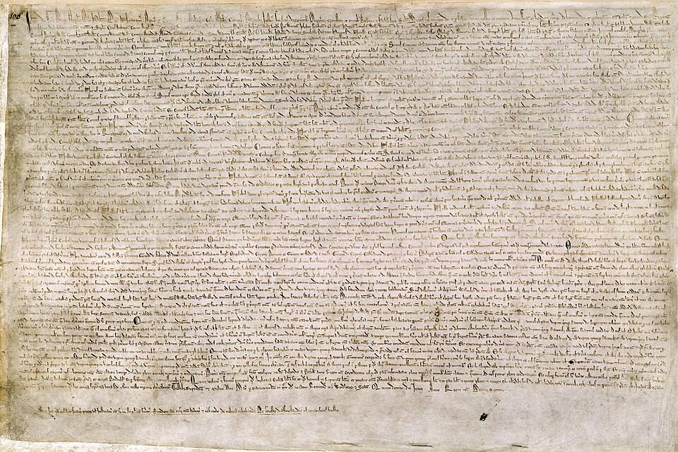

On 15 June 1215, in a water-meadow called **Runnymede** beside the Thames,
King John of England set his seal to a charter drawn up by barons who had
rebelled against him. It was a peace treaty, and it failed within weeks. It
is also one of the most famous legal documents ever written.

## A treaty with a king

John's reign had gone badly. He had lost Normandy and most of his family's
lands in France, and to pay for the wars he squeezed his barons with heavy
taxes, arbitrary fines and the sale of justice. In the spring of 1215 a group
of them renounced their allegiance and took London. Negotiations followed,
and the result was a long charter of promises the king made to "all the free
men of our kingdom".

Much of it deals with particular grievances: inheritance taxes, the rights
of widows, fish-weirs on the Thames, the royal forests. But a few clauses
reach much further. In the words of the British Library's translation:

> No free man shall be seized or imprisoned, or stripped of his rights or
> possessions, or outlawed or exiled, or deprived of his standing in any
> way, nor will we proceed with force against him, or send others to do so,
> except by the lawful judgement of his equals or by the law of the land.
>
> To no one will we sell, to no one deny or delay right or justice.

A further clause set up a council of twenty-five barons with the right to
seize the king's castles and lands if he broke his word. That is the
startling part: the king's own charter provided for his own coercion.

## Annulled, and reissued

Neither side kept the bargain. John appealed to Pope Innocent III, who
annulled the charter that August, and England slid into civil war. John died
the following year. But his young son Henry III's advisers reissued the
charter, in revised form, in 1216 and 1217, and Henry issued it again in 1225
in exchange for a tax. In 1297 it was confirmed as part of the statute law
of England. Three of its clauses remain in force in England and Wales today.

## The idea that outlived the document

For centuries Magna Carta was more symbol than statute. In the seventeenth
century, lawyers such as Sir Edward Coke used it against the Stuart kings,
reading into it a guarantee of trial by jury and of the rule of law. From
there it crossed the Atlantic, into colonial charters and the American Bill
of Rights, and into the idea of "due process of law".

Four copies of the 1215 charter survive: two at the British Library, one at
Lincoln Castle and one at Salisbury Cathedral. They are written in dense,
abbreviated Latin on a single sheet of parchment. The principle they carry
is simpler than their script: the ruler is under the law, not above it.

