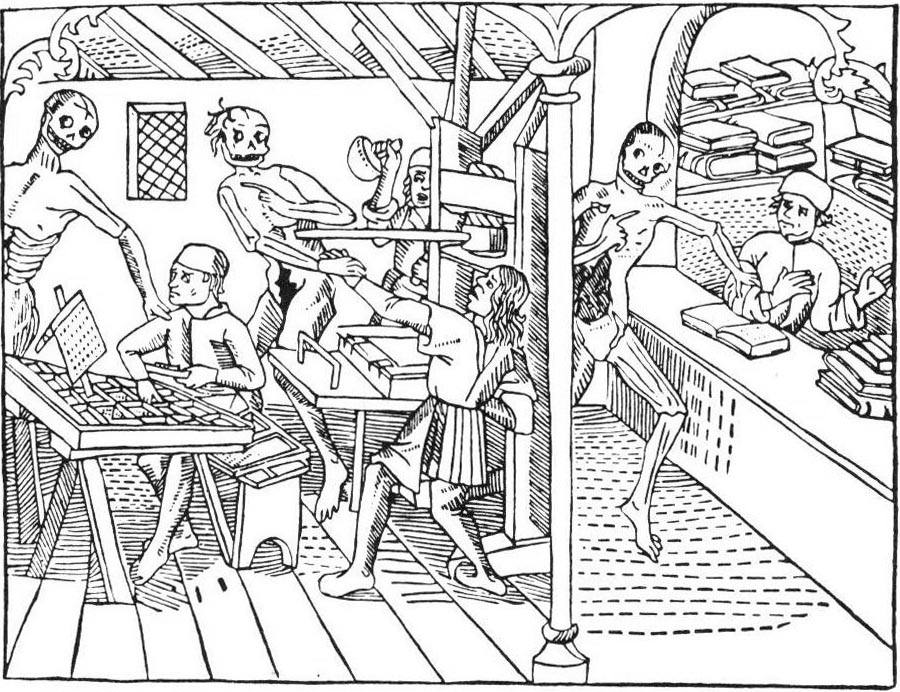

For four thousand years every copy of a text had been made by hand. In the
middle of the fifteenth century a goldsmith from **Mainz** found a way to make
them by machine, and within fifty years the number of books in Europe had
changed beyond recognition.

## The invention

**Johannes Gutenberg** worked on his "enterprise and art" in Strasbourg in the
late 1430s and early 1440s, and by about 1450 he was printing in Mainz, on
money borrowed from a merchant, Johann Fust. None of the pieces was new on
its own. Movable type had been made in China by the eleventh century, and
Korean printers were casting it in metal before Gutenberg was born. What
Gutenberg put together was a _system_ suited to the Latin alphabet:

- a **hand mould** for casting any letter quickly and to the same height,
  so thousands of identical pieces of type could be made;
- a **type metal** of lead, tin and antimony that melted at a low
  temperature, cast cleanly and wore well;
- an **oil-based ink** that stuck to metal, where the water-based inks used
  for woodblocks would not;
- a **screw press**, adapted from the presses used for wine, paper and
  linen, that pressed paper evenly onto a whole page of type at once.

The woodcut above, from a _Danse macabre_ printed in Lyon in 1499, is the
oldest known picture of a printing shop. On the left a compositor sets type
from a case; in the centre the pressman pulls the bar of the press while his
partner inks the forme; on the right a bookseller keeps his shop.

## Knowledge went viral

Printing spread down the trade routes with the printers themselves: Cologne
by 1466, Rome by 1467, Venice by 1469, Paris by 1470, London by 1477. By 1481
Italy and Germany each had printers working in about forty towns.

The economic historians Eltjo Buringh and Jan Luiten van Zanden have
estimated how many printed books Europe produced. Estimates for the first
decades vary — others put the total by 1500 at twenty million copies or more
— but the shape of the curve is not in doubt.

| Period    | Printed books (copies) |
| --------- | ---------------------: |
| 1454–1500 |          ~12.6 million |
| 1501–1600 |           ~217 million |
| 1601–1700 |           ~532 million |
| 1701–1800 |           ~984 million |

A text that was printed could no longer be lost by the burning of one
library, and a thousand readers could hold the same words, page for page. A
scholar could cite page 57 and know a colleague in another city would find
the same passage there. Errors, once printed, spread too, but so did their
corrections.

## What it changed

The press made reputations and revolutions. Some 750,000 copies of Erasmus's
works are thought to have sold in his lifetime. When Martin Luther challenged
the Church in 1517, printers across Germany turned his writings into the
first mass media campaign: around 300,000 copies of his works between 1518
and 1520 alone. Scientific books, maps, grammars, almanacs and ballads
followed. The Reformation, the Scientific Revolution and the rise of vernacular
literature all ran on paper and ink.

Follow the trail from here into Gutenberg's workshop, and the book that
proved the method: the 42-line Bible.
