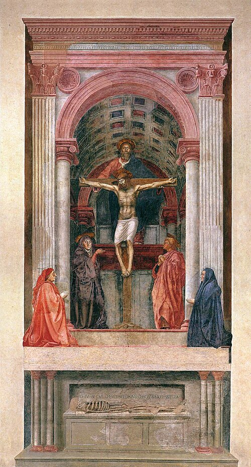

In the early 1300s a Paduan banker, Enrico Scrovegni, bought the ground where the city's Roman arena had stood, built a palace on it and, beside the palace, a chapel for his family and his tomb. The Florentine painter **[Giotto](kloom:e/giotto)** and a team of about forty covered its walls and vault with the lives of the Virgin and of Christ, and the chapel was consecrated in 1305. By one count the **[Scrovegni Chapel](kloom:e/scrovegni-chapel)** took 625 _giornate_, days of work. What was new, its Wikipedia article sums up, was "the monumentality of his forms and the clarity of his compositions", and the Florentine chronicler Giovanni Villani wrote that Giotto "drew all his figures and their postures according to nature". Dante noticed too. "In painting Cimabue thought that he / Should hold the field," he wrote in the _Purgatorio_, in Longfellow's translation, "now Giotto has the cry."

## The window

A century later, painters in Florence learned to build that depth by rule. The architect **[Filippo Brunelleschi](kloom:e/filippo-brunelleschi)** showed it first, some time between about 1415 and 1425, with a painted panel of the Baptistery seen through a hole and a mirror; the frame on perspective in the mathematics subject tells the demonstration and the geometry. **[Masaccio](kloom:e/masaccio)**'s **[Holy Trinity](kloom:e/holy-trinity-masaccio)**, painted on a wall of Santa Maria Novella in the mid-1420s, is among the first large paintings built on it. Its horizon runs between the two kneeling donors, at the eye level of a person standing in the church, and the coffered vault behind the cross is drawn so that, as the painter and biographer **[Giorgio Vasari](kloom:e/giorgio-vasari)** later put it in Gaston de Vere's translation, "the wall appears to be pierced."

In 1435 **[Leon Battista Alberti](kloom:e/leon-battista-alberti)** wrote the method down in _On Painting_ (**[_De pictura_](kloom:e/de-pictura)**), and dedicated it to Brunelleschi. In James Leoni's English of 1755, made from an Italian translation, it goes like this, and the plate draws it:

| Step              | Alberti's instruction                                                                                                                                                                                            |
| ----------------- | ---------------------------------------------------------------------------------------------------------------------------------------------------------------------------------------------------------------- |
| The window        | "I draw a Square composed of right Angles, as large as I think convenient; and this serves me as a Window through which I am to view the Story which is to be painted."                                          |
| The measure       | Divide the height of a man into three parts, each a _braccio_, and divide the bottom line of the square into as many _braccia_ as it holds                                                                       |
| The centric point | "one single Point where the Sight is to be directed", set no higher above the ground line than the man is tall, "Because by this means the Beholder and the Objects painted will seem to be upon the same Plain" |
| The orthogonals   | "straight Lines from that to each of the Divisions of the lower straight Line"                                                                                                                                   |
| The transversals  | On a separate sheet, the same divisions, a point as high as the centric point, and lines from it to each division; a perpendicular at the chosen distance cuts them at the heights of the floor's cross lines    |
| The proof         | "one continued straight Line drawn on the fictitious Pavement will be the Diagonal of all the Squares"                                                                                                           |

Alberti rejected the workshop rule of shrinking each row of tiles by a third of the one before: it had "nothing whereby to fix the certain and determinate Place" of the eye. In the plate the eye stands three _braccia_ from the picture, and the proving diagonal, carried on, meets the horizon three _braccia_ from the centric point.

## The workshop

Painters were trained as craftsmen. **[Cennino Cennini](kloom:e/cennino-cennini)**'s handbook, written around 1400, in Christiana Herringham's translation of 1899, asks a year of drawing, then six years in a master's shop grinding colors, boiling glue, laying grounds and gilding, then six more learning to color and to paint on walls. For **[fresco](kloom:e/fresco)**, he says, "consider how much you can paint in a day; for whatever you cover with the plaster you must finish the same day." Blue was the problem. **[Ultramarine](kloom:e/ultramarine)**, ground from lapis lazuli brought from Afghanistan, does not take well to wet lime, so it was often added on dry plaster, and good ultramarine could cost as much as gold. Andrea del Sarto's contract of 1514 required the Virgin's robe in ultramarine of "at least five good florins an ounce"; in 1508 Albrecht Dürer told a patron, in Conway's translation, "I cannot buy an ounce of it good for less than 10 or 12 ducats."

Not every experiment held. **[Leonardo da Vinci](kloom:e/leonardo-da-vinci)**, trained in Verrocchio's workshop, painted the _Last Supper_ in Milan in tempera over a gesso ground rather than in fresco, and within a hundred years one viewer called it "completely ruined".

## The ceiling

**[Michelangelo](kloom:e/michelangelo)**, a sculptor, signed the contract for the **[Sistine Chapel ceiling](kloom:e/sistine-chapel-ceiling)** on 8 May 1508, for 3,000 ducats. He refused the scaffold Bramante hung from holes in the vault and had one built standing on beams set into the walls above the cornice, and he worked standing, head tilted back. In a sonnet to a friend, in John Addington Symonds's translation of 1878: "My beard turns up to heaven; my nape falls in, / Fixed on my spine". The restorers who cleaned the ceiling between 1980 and 1994 counted its _giornate_. Historians arguing over the order of the work cite about 300 for its first two years and 270 for the last, some 570 by our arithmetic. The figure of God in the last scene of the creation was painted in a single day, and among the panels is **[The Creation of Adam](kloom:e/the-creation-of-adam)**. The ceiling was shown on 31 October 1512.

## Craftsman to genius

That a painter could be a genius rather than a tradesman is in large part the work of Vasari, whose _Lives_ of the artists appeared in 1550 and, enlarged, in 1568. Vasari tells how Giotto drew a perfect circle freehand for a pope's envoy, and how Michelangelo finished the ceiling "in twenty months ... by himself alone, without the assistance even of anyone to grind his colours." The documents say otherwise: the work ran from 1508 to 1512, and Vasari himself names the Florentine painters brought to help. Historians read him gratefully and warily, as a partisan of Florence who repeated workshop legends. The next frame turns to the man who first worked out the window, and the dome he built over Florence.
