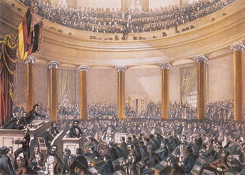

On 12 January 1848 the people of Palermo rose against their Bourbon king. Six weeks later Paris followed. On the evening of 23 February soldiers on the Boulevard des Capucines fired into a crowd and killed 52 people; that night Parisians built some 1,500 barricades, and the next day King Louis-Philippe abdicated. On his throne, before it was burned, someone wrote: "The People of Paris to All Europe: Liberty, Equality, Fraternity." News of it crossed the continent within a week. In Vienna, **[Klemens von Metternich](kloom:e/klemens-von-metternich)**, the architect of Europe's conservative order since 1815, was heard to say, "Well, my dear, it's all over!" He resigned on 13 March. The **[Revolutions of 1848](kloom:e/revolutions-of-1848)** had begun, the widest wave of revolution in Europe's history, touching more than fifty countries by one count:

| City    | Rising         | Day of 1848 |
| ------- | -------------- | ----------- |
| Palermo | 12 January     | 12          |
| Paris   | 22–24 February | 55          |
| Vienna  | 13 March       | 73          |
| Pest    | 15 March       | 75          |
| Berlin  | 18 March       | 78          |
| Milan   | 18 March       | 78          |

The ground had been laid by hunger. Potato blight from 1845, a failed grain harvest in 1846 and a slump in 1847 spread hunger and unemployment, and the economic historians Helge Berger and Mark Spoerer found that the countries hit hardest by the slump were the ones that rose.

## What they wanted

Everywhere the crowds asked for much the same things: a constitution, an elected parliament, a free press, the right to meet and form associations, a citizens' militia, and in many places the vote for every man. They also asked to be nations. Germans and Italians wanted one state each in place of dozens, and Hungarians, Czechs, Poles, Croats and Romanians each wanted their own say within, or against, the Austrian Empire, which set them against one another. Some of what they won lasted. Hungary abolished serfdom that spring, and Austria's new parliament, on a bill of the 25-year-old **[Hans Kudlich](kloom:e/hans-kudlich)**, abolished the forced labor that peasants had owed their lords.

## A parliament for Germany

The **[Frankfurt Parliament](kloom:e/frankfurt-national-assembly)** was the first elected by all the German states. The rule was one deputy for every 50,000 inhabitants, 649 seats; Czech districts boycotted it, which left 585. Each state ran its own election, most of them indirectly, through electors, and the vote went to "independent" adult men, about 85 percent of all men. They met on 18 May 1848 in **[St. Paul's Church](kloom:e/st-pauls-church-frankfurt)**, an oval church with seats for 600 deputies and a gallery for 2,000 spectators, and twelve stenographers took down every debate. Most deputies were officials, judges and lawyers, 49 of them professors. Its first work was a law of **Basic Rights** for every German, in force from 27 December 1848. Among them:

| Basic right             | What it meant                                                                                         |
| ----------------------- | ----------------------------------------------------------------------------------------------------- |
| Equality before the law | The nobility abolished as an estate, with all its privileges                                          |
| The person              | Arrest only on a judge's warrant; the death penalty (with exceptions), pillory and flogging abolished |
| The mind                | A free press without censorship; science and its teaching free                                        |
| Faith                   | No religion a bar to civil rights; civil marriage before any church wedding                           |
| The land                | Serfdom and the lords' private courts abolished                                                       |
| Minorities              | The non-German peoples' languages equal in their schools, churches and courts                         |

The deputy Jacob Grimm wanted the list to open, in our translation, "The German people is a people of free men, and German soil tolerates no servitude"; it was not adopted. The plate draws the church in plan, and the vote that followed.

On 28 March 1849, by 290 votes with 248 abstaining, the parliament elected **[Frederick William IV](kloom:e/frederick-william-iv)** of Prussia hereditary emperor of a German Reich. He had already told his ambassador in London what he thought of such a crown: "an imaginary hoop baked from dirt and weeds". On 21 April he refused it. Austria recalled its deputies and Prussia's resigned, the rump that moved to Stuttgart was dispersed by soldiers in June, and in 1851 the German Confederation declared the Basic Rights void.

## France: the vote, and its uses

In Paris the provisional government of the **[Second Republic](kloom:e/french-second-republic)** gave the vote to every man, nearly ten million of them, and on 27 April, in a decree written by **[Victor Schœlcher](kloom:e/victor-schoelcher)**, abolished slavery in the French colonies for good. But the April elections returned a conservative assembly, which closed the national workshops for the unemployed. In the **[June Days](kloom:e/june-days-uprising)** that followed, some 3,000 insurgents were killed or wounded and 4,000 were deported to Algeria. In December the new voters elected Napoleon's nephew, **[Louis-Napoléon Bonaparte](kloom:e/napoleon-iii)**, president, with 74 percent. In December 1851 he seized power in a coup, and then made himself emperor. The historian Malcolm Crook has asked whether universal suffrage was, as practiced in 1848, a form of counter-revolution.

## The manifesto in the middle

In late February a 23-page pamphlet in German appeared in London, written by **[Karl Marx](kloom:e/karl-marx)** with **[Friedrich Engels](kloom:e/friedrich-engels)** for the Communist League: **[_The Communist Manifesto_](kloom:e/the-communist-manifesto)**. "A spectre is haunting Europe," it begins, in the English edition of 1888 that Engels edited, "the spectre of Communism." It predicted that Germany, "on the eve of a bourgeois revolution", with a far larger working class than England had had in the seventeenth century or France in the eighteenth, would make it "but the prelude" to a workers' revolution. It came out as the revolutions began and did not cause them; its influence in 1848 hardly reached beyond Germany.

Why the revolutions failed is less argued than what they left. Liberals came to fear a workers' revolution more than the old order, nations fought nations, and the armies stayed loyal to their crowns. Historians long counted 1848 a failure. Christopher Clark argues that it changed how Europe was governed even so, and many of its demands were met by the 1870s, mostly by its enemies: unity in Italy and Germany, the subject of the frame on unification. In Paris the crowds had written the words of 1789 on a king's throne, nearly sixty years after the **[French Revolution](kloom:e/french-revolution)**, where this trail began.
