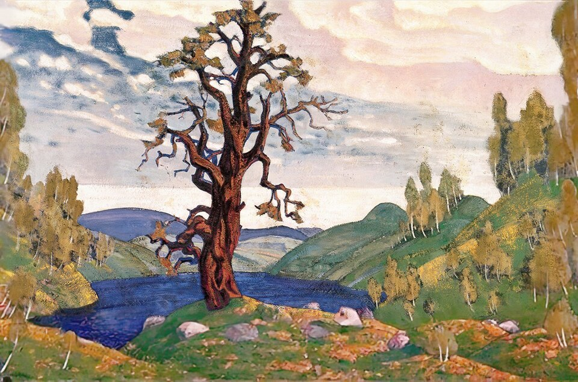

On the evening of Thursday, 29 May 1913, the **[Théâtre des Champs-Élysées](kloom:e/theatre-des-champs-elysees)**, a concrete hall in **[Paris](kloom:e/paris)** that had opened only eight weeks before, was full for the **[Ballets Russes](kloom:e/ballets-russes)**. Its manager had paid **[Sergei Diaghilev](kloom:e/sergei-diaghilev)**'s company 25,000 francs a performance, and ticket prices were doubled for a premiere. After _Les Sylphides_ came a new ballet, **[_The Rite of Spring_](kloom:e/the-rite-of-spring)** (_Le Sacre du printemps_): music by **[Igor Stravinsky](kloom:e/igor-stravinsky)**, who was thirty, choreography by the company's star dancer **[Vaslav Nijinsky](kloom:e/vaslav-nijinsky)**, scenery and costumes by the painter and archaeologist **[Nicholas Roerich](kloom:e/nicholas-roerich)**. **[Pierre Monteux](kloom:e/pierre-monteux)** conducted an orchestra of 99, drawn mainly from the Concerts Colonne, far more than the theater usually employed, and they barely fitted into the pit.

## What happened in the hall

Everyone agrees there was an uproar; almost nothing else is agreed. In Stravinsky's own telling, in his autobiography of 1936, derisive laughter began at the first bars, he left his seat for the wings, and the noise drowned out Nijinsky, who was shouting the counts to his dancers. Monteux remembered that "everything available was tossed in our direction, but we continued to play on". The American critic **[Carl Van Vechten](kloom:e/carl-van-vechten)** wrote in 1915 that the young man behind him in his box grew so excited that he "began to beat rhythmically on the top of my head with his fists"; a letter of 1916, published only in 2013, admits that Van Vechten was there on the second night, not the first. Some forty people were thrown out, perhaps by the police, which no one confirms. The dancer Marie Rambert said the music could not be heard on the stage, yet by several accounts the closing dance was watched in near silence, and there were curtain calls.

The critics split along the same line as the audience. _Le Figaro_'s Henri Quittard called the work "a laborious and puerile barbarity"; Gustav Linor in _Comœdia_ thought the disturbance merely "a rowdy debate" between two ill-mannered factions. Whether the music or the dancing caused it is still argued. The historian Richard Taruskin holds that "it was not Stravinsky's music that did the shocking", but Nijinsky's "ugly earthbound lurching and stomping". The word "riot" itself comes from reviews of 1924. The ballet ran six nights in Paris and four in London, and Nijinsky's choreography was then lost until the Joffrey Ballet staged a reconstruction in 1987.

## How the music works

The work opens with a solo bassoon playing a folk tune so high in its register that listeners could not tell what instrument it was. Stravinsky admitted that this one melody came from a printed anthology of Lithuanian folk songs; scholars have since found more. The first dance, the "Augurs of Spring", stamps out a single chord, and it is two chords at once:

| Layer                   | Notes         | Key        |
| ----------------------- | ------------- | ---------- |
| Upper strings and horns | E♭, G, B♭, D♭ | E♭ seventh |
| Lower strings           | F♭, A♭, C♭    | F♭ major   |

Each half is ordinary; together they clash a semitone apart. The chord repeats in even eighth notes, and what moves is the accent. The scholar Roger Nichols counted the eighth notes between the accents of the first outburst: 9, 2, 6, 3, 4, 5, 3.

The final "Sacrificial Dance" goes further and changes the length of the bar itself. In the full score of 1921, which Stravinsky rebarred for performers, its refrain begins:

| Bar            |    1 |    2 |    3 |    4 |   5 |    6 |    7 |    8 |   9 |   10 |   11 |   12 |  13 |   14 |  15 |   16 |   17 |
| -------------- | ---: | ---: | ---: | ---: | --: | ---: | ---: | ---: | --: | ---: | ---: | ---: | --: | ---: | --: | ---: | ---: |
| Time signature | 3/16 | 2/16 | 3/16 | 3/16 | 2/8 | 2/16 | 3/16 | 3/16 | 2/8 | 3/16 | 3/16 | 5/16 | 2/8 | 3/16 | 2/8 | 5/16 | 5/16 |

The sixteenth note is the only steady pulse. By our count, the bar changes length 27 times in the refrain's 33 bars, which the plate draws to scale. Stravinsky could play this at the piano before he knew how to write it down: in 1913 he barred it in longer, odder units, rebarred it into these short ones for the 1921 score, and recast it again in 1943. The orchestra is a giant's: eight horns, five trumpets, five timpani for two players, a bass trumpet, Wagner tubas, a güiro and antique cymbals, though much of the score is written for small groups within it.

## Pictures of pagan Russia

The subtitle is "Pictures of Pagan Russia in Two Parts". Elders, games and rival tribes give way to the night, when a girl is chosen and dances herself to death before the elders to bring the spring; at the premiere the Chosen One was Maria Piltz. Stravinsky later said it began with a vision of exactly that scene, though in 1920 he had said the music came first and the story after; the historian Thomas Kelly credits Roerich, an expert on ancient Slavic ritual, with much of the scenario. To Paris in 1913 it was the exotic primitive Russia it had come to the Ballets Russes for, made violent. To later listeners it was one of the first works of musical modernism, built, as Taruskin showed, from Russian tradition.

## A crowded year

Stravinsky was not alone. In February New York's Armory Show had brought cubist painting to America, and in March a concert of **[Arnold Schoenberg](kloom:e/arnold-schoenberg)**'s circle in Vienna had ended in a brawl. **[Pablo Picasso](kloom:e/pablo-picasso)** and **[Georges Braque](kloom:e/georges-braque)** had been taking objects apart into overlapping planes since about 1908, and in 1912 began gluing paper into their pictures. Marcel Proust's first volume came out in November. **[James Joyce](kloom:e/james-joyce)**'s _Dubliners_ followed in 1914, and **[T. S. Eliot](kloom:e/t-s-eliot)**'s "Prufrock" in 1915. Their work is still in copyright, so it is described here and not shown.

Fourteen months after the premiere Europe was at war, and Nijinsky, a Russian subject, was held under house arrest in Hungary as an enemy citizen. The next frame is that war.
