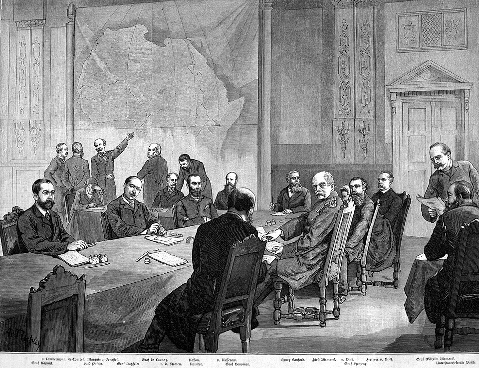
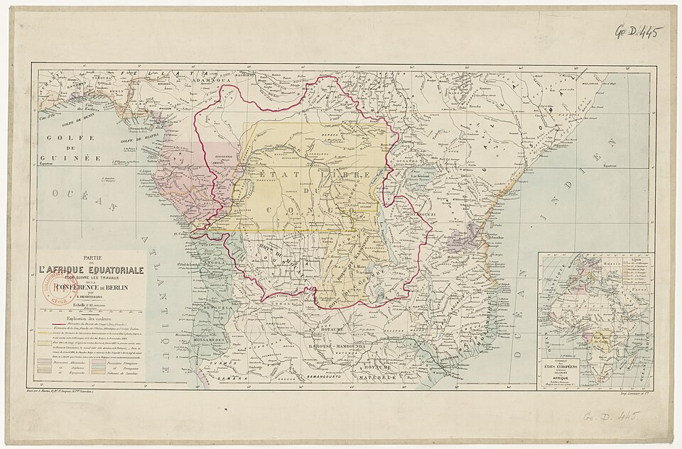

In 1880, by the Ghanaian historian Adu Boahen's reckoning, about 80 percent of Africa was still ruled by its own kings, queens, clan heads and councils. Europe held coasts and footholds: Algeria, the Cape, the coastal towns of West Africa, Portuguese stretches of Angola and Mozambique. By 1914 every part of the continent except Ethiopia and Liberia was under European rule. The **[Scramble for Africa](kloom:e/scramble-for-africa)** took a generation, and Africans had no say in the rules by which it was done.

## A conference about Africa

The rules were written in Berlin. **[Otto von Bismarck](kloom:e/otto-von-bismarck)**, at the request of King **[Leopold II of Belgium](kloom:e/leopold-ii-of-belgium)**, called the **[Berlin Conference](kloom:e/berlin-conference)**, which met from 15 November 1884 to 26 February 1885. Fourteen states sent delegates, the United States and the Ottoman Empire among them. No African state was invited; the Sultan of Zanzibar asked to send a representative and was refused.

The General Act they signed, in the American translation of 1909, said three things about land:

| Article | What it says                                                                                                                                                                                                |
| ------- | ----------------------------------------------------------------------------------------------------------------------------------------------------------------------------------------------------------- |
| 6       | The powers "bind themselves to watch over the preservation of the native tribes, and to care for the improvement of the conditions of their moral and material well-being", and to suppress the slave trade |
| 34      | A power taking "a tract of land on the coasts of the African continent", or a protectorate there, must send "a notification thereof" to the others                                                          |
| 35      | The powers "recognize the obligation to insure the establishment of authority in the regions occupied by them on the coasts", enough "to protect existing rights"                                           |

This was "effective occupation": a claim counted if it was announced and backed by treaties, a flag, an administration and police. The conference also recognized King Leopold's own colony, the **[Congo Free State](kloom:e/congo-free-state)**, whose first borders were, apart from the river, mostly straight lines.

## Lines on the map

Berlin itself drew few borders. Most came from treaties between pairs of powers over the next twenty years. How many are straight lines is disputed. Economists have repeated that "eighty percent of African borders follow latitudinal and longitudinal lines" (Alberto Alesina and colleagues, 2011). Jack Paine and colleagues, coding every border in 2024, found water the main feature of 63 percent of them and straight lines of 37 percent, about half of these on a parallel or a meridian, mostly in desert. They found that the frontiers of earlier African states shaped 62 percent of borders, learned from treaties and from Africans themselves.

| Study                        | Share on a parallel or meridian |
| ---------------------------- | ------------------------------- |
| Alesina and colleagues, 2011 | 80%                             |
| Barbour, 1961                | 44%                             |
| Paine and colleagues, 2024   | 18%                             |

The means of conquest were new. **[Quinine](kloom:e/quinine)**, taken as a preventive against malaria, made Europeans, in Boahen's words, "far less fearful of Africa"; it was the drug William Perkin had set out to make in 1856. And there was the **[Maxim gun](kloom:e/maxim-gun)** of 1884, the first fully automatic machine gun. Boahen quotes Hilaire Belloc's verse of 1898: "Whatever happens we have got / The maxim-gun and they have not."

## Leopold's Congo

The Free State was Leopold's own, not Belgium's. From the 1890s its agents and concession companies made villages bring in wild rubber by quota, three to four kilograms per man every two weeks in one company's lands. In 1903 the British consul **[Roger Casement](kloom:e/roger-casement)** traveled upriver. He saw women and children "seized as hostages and kept in detention until rubber or other things were brought in", and met people whose hands soldiers had cut off. At Lukolela, which he had known in 1887 with "fully 5,000 people", he counted fewer than 600. Refugees told him, in his record of their words: "We said to the white men, 'We are not enough people now to do what you want us. Our country has not many people in it and we are dying fast.'"

His report of 1904 and the campaign of the journalist **[E. D. Morel](kloom:e/e-d-morel)**, whose Congo Reform Association was founded that year, forced the issue, and Belgium annexed the colony in 1908. How many died will never be known: there was no census until 1924. Adam Hochschild's _King Leopold's Ghost_ (1998) used about 10 million; the demographer Jean-Paul Sanderson (2020) found 1 to 5 million the possible range, most likely nearer one. Most deaths came from disease and hunger, made worse by the upheaval the regime caused.

## Resistance

Rulers said no in their own words. "I am Sultan here in my land. You are Sultan there in yours," Machemba of the Yao told a German commander in 1890. In Ethiopia **[Menelik II](kloom:e/menelik-ii)** beat an Italian army at the **[Battle of Adwa](kloom:e/battle-of-adwa)** on 1 March 1896, and Italy recognized his independence; the prime minister whose government fell over it, Francesco Crispi, had helped launch Garibaldi's Thousand. In the **[German Empire](kloom:e/german-empire)**'s East African colony the **[Maji Maji Rebellion](kloom:e/maji-maji-rebellion)** of 1905–07 rose against forced cotton growing; it ended in a famine, and 75,000 to 300,000 died. In German South West Africa, after the Herero rose in 1904, General **[Lothar von Trotha](kloom:e/lothar-von-trotha)** ordered that "every Herero, with or without firearms, with or without cattle, will be shot". In the **[Herero and Nama genocide](kloom:e/herero-and-nama-genocide)** some 40,000 to 80,000 Herero and 10,000 Nama died, many in camps, by 1908. On 28 May 2021 Germany's foreign minister said that it would "officially call these events what they are from today's perspective: a genocide", and offered 1.1 billion euros; most Herero and Nama organizations rejected the deal for leaving them out of it.

By 1902, Paine and colleagues find, the map already looked much as it would after independence. In 1914 the powers that had divided Africa went to war with one another, in the frame on the First World War.
