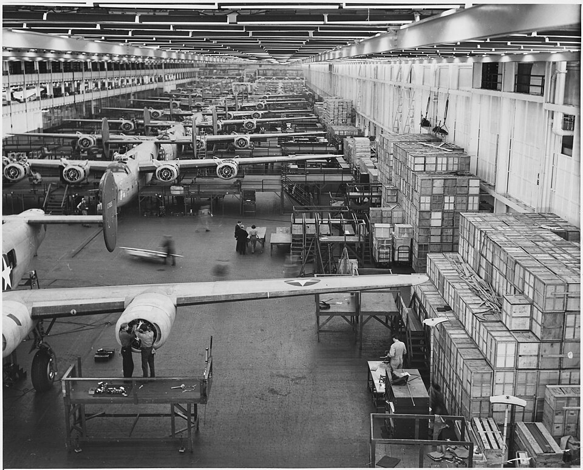

At dawn on 1 September 1939 the armies of **[Nazi Germany](kloom:e/nazi-germany)** crossed into Poland. Two days later Britain and France declared war, and on 17 September the **[Soviet Union](kloom:e/soviet-union)** invaded Poland from the east. The **[Second World War](kloom:e/world-war-ii)** that followed killed some 60 to 75 million people, most of them civilians: about three in every hundred people alive in 1940.

## The road from 1933

**[Adolf Hitler](kloom:e/adolf-hitler)** became chancellor of Germany on 30 January 1933 and by July had made it a one-party state. In March 1935 he announced an air force and an army of 550,000 men, in open breach of the Treaty of Versailles. Britain and France let him take Austria and then, by the **[Munich Agreement](kloom:e/munich-agreement)** of 30 September 1938, the borderlands of Czechoslovakia. On 23 August 1939 Germany and the Soviet Union, sworn ideological enemies, signed the **[Molotov–Ribbentrop Pact](kloom:e/molotov-ribbentrop-pact)**, a promise not to attack each other. Its secret additional protocol, published only after the war, divided Eastern Europe between them:

> In the event of a territorial and political rearrangement of the areas belonging to the Polish state the spheres of influence of Germany and the U.S.S.R. shall be bounded approximately by the line of the rivers Narew, Vistula, and San.

That is where the two armies met in Poland three weeks later. Where the war began is itself a question: in China it had been fought since Japan's full invasion in July 1937, and some historians date the Pacific war from then, or from Manchuria in 1931.

## The war in outline

| When                 | What                                                                               |
| -------------------- | ---------------------------------------------------------------------------------- |
| May–June 1940        | Germany overruns the Low Countries and France, which signs an armistice on 22 June |
| July–October 1940    | The Battle of Britain: the Royal Air Force holds off the Luftwaffe                 |
| 22 June 1941         | Operation Barbarossa: some 3.8 million Axis troops invade the Soviet Union         |
| 7 December 1941      | Japan attacks Pearl Harbor, the Philippines, Malaya and Hong Kong                  |
| August 1942–Feb 1943 | Stalingrad: the German Sixth Army surrenders on 2 February                         |
| 6 June 1944          | The Allied landings in Normandy                                                    |
| February–March 1945  | Firebombing of Dresden (up to 25,000 dead) and Tokyo (some 90,000 to 100,000 dead) |
| 6 and 9 August 1945  | American atomic bombs destroy Hiroshima and Nagasaki                               |

The attack on **[Pearl Harbor](kloom:e/attack-on-pearl-harbor)** killed 2,403 Americans and brought the United States in; by then the war ran from the Atlantic to the Pacific. Whether the bombing of cities shortened the war, and whether the atomic bombs were needed to end it, are still argued. The US Secretary of War, Henry Stimson, wrote in 1947 that they saved a million casualties; the historian Tsuyoshi Hasegawa argues that the Soviet declaration of war on Japan, two days after Hiroshima, did more to bring the surrender. How the bomb was made is told in the physics frame on the Manhattan Project.

## A war of factories

Until about the end of 1941, the economic historian **Mark Harrison** writes, the war went the Axis's way and armies mattered more than economies. After that the Allies' factories decided it. His tables count the weapons each power built:

| Power          | Combat aircraft | Tanks and self-propelled guns | Months at war in the count |
| -------------- | --------------: | ----------------------------: | -------------------------: |
| United States  |         192,000 |                        99,500 |                         45 |
| Soviet Union   |         112,100 |                       102,800 |                         50 |
| United Kingdom |          94,600 |                        29,300 |                         72 |
| Germany        |          89,500 |                        46,300 |                         68 |
| Japan          |          55,100 |                         4,800 |                         72 |
| Italy          |          13,300 |                         3,000 |                         38 |

In 1942–44, Harrison finds, Allied production of tanks was five times the Axis's. Part of the difference was who worked: Germany and Japan were reluctant to put women into their factories, while more than a million women served in the Soviet armed forces. Through **[Lend-Lease](kloom:e/lend-lease)**, from March 1941, the United States gave Britain, the Soviet Union, China and others $50.1 billion of food, oil and weapons, free of charge. The plate draws aircraft output year by year: Germany's peak came in 1944, when America's was more than twice as high. The car makers turned to weapons. At **[Willow Run](kloom:e/willow-run)** in Michigan the **[Ford Motor Company](kloom:e/ford-motor-company)** built B-24 Liberator bombers on moving assembly lines, the method it had first used for the Model T, and by 1944 one came off the line every 63 minutes. The same logic ran through everything: codebreakers at **[Bletchley Park](kloom:e/bletchley-park)** reading the German **[Enigma](kloom:e/enigma-machine)** traffic with machines, and from August 1944 the US Army flying whole blood across the Atlantic to its wounded, by 1945 more than a thousand pints a day.

## The cost

More than half of the dead were Chinese and Soviet. The Russian government puts the Soviet Union's losses at 26.6 million, soldiers and civilians, and Poland lost between 5.6 and 5.8 million. The war in the east, opened by **[Operation Barbarossa](kloom:e/operation-barbarossa)**, was fought as one of extermination: Germany planned to empty the conquered lands for German settlers, and deliberately starved or killed 3.3 million Soviet prisoners of war. At the center of it was **[the Holocaust](kloom:e/the-holocaust)**, the murder of about six million Jews by Nazi Germany and its collaborators, which the next frame tells. Japan's armies massacred civilians from Nanjing in 1937 onward, and held Allied soldiers and civilians in camps across their conquests, Manila's Santo Tomas among them.

## The end

Germany surrendered on 8 May 1945, and Japan signed its surrender aboard the USS _Missouri_ in Tokyo Bay on 2 September. Even before Japan's surrender the Allies had written the law for trying Germany's leaders: the Charter of the International Military Tribunal, of 8 August 1945. Its Article 6 made three crimes, with "individual responsibility":

| Count                   | In the Charter's words                                                                                               |
| ----------------------- | -------------------------------------------------------------------------------------------------------------------- |
| Crimes against peace    | "planning, preparation, initiation or waging of a war of aggression"                                                 |
| War crimes              | "violations of the laws or customs of war"                                                                           |
| Crimes against humanity | "murder, extermination, enslavement, deportation, and other inhumane acts committed against any civilian population" |

At the **[Nuremberg trials](kloom:e/nuremberg-trials)**, from 20 November 1945 to 1 October 1946, twenty-two leaders were tried: twelve were sentenced to death and three acquitted. Three years later the United Nations set down, in the Universal Declaration of Human Rights, what the war had shown needed protecting.
