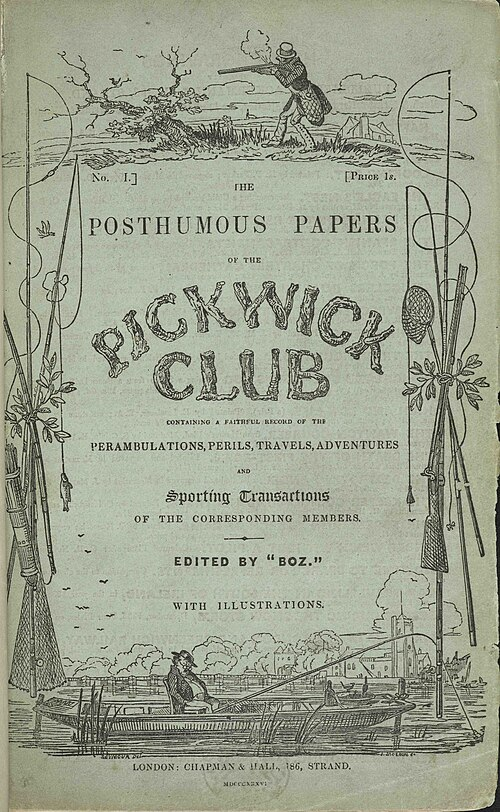

On 31 March 1836 the [London](kloom:e/london) publishers **[Chapman & Hall](kloom:e/chapman-and-hall)** brought out a thin booklet in a green paper wrapper, price one shilling: number one of _The Posthumous Papers of the Pickwick Club_, "edited by Boz". Boz was **[Charles Dickens](kloom:e/charles-dickens)**, a 24-year-old parliamentary reporter. The firm had wanted words to go with a monthly series of comic "cockney sporting plates" by the artist **[Robert Seymour](kloom:e/robert-seymour-illustrator)**, about a club of hapless sportsmen. Dickens, by his own account, objected "that it would be infinitely better for the plates to arise naturally out of the text", and got his way. Of part one, his friend and biographer **[John Forster](kloom:e/john-forster-biographer)** wrote, the binder prepared four hundred copies. Of part fifteen he ordered more than forty thousand. **[_The Pickwick Papers_](kloom:e/the-pickwick-papers)** had made the novel a thing that arrived every month, like the rent.

## How a number worked

| Part of the bargain | How it was done                                                                                                                                 |
| ------------------- | ----------------------------------------------------------------------------------------------------------------------------------------------- |
| The number          | 24 pages, a sheet and a half of print, and four plates at first; after Seymour's death in April 1836, 32 pages and two plates "to the end"      |
| The wrapper         | Green paper, with advertisements for household goods bound in                                                                                   |
| The writer          | Paid fifteen guineas a number, more as sales rose; writing, once _Oliver Twist_ was running too, "not even by a week in advance of the printer" |
| The pictures        | Etched, from the fourth number on, to fit the text Dickens had written                                                                          |
| The calendar        | Out on the last day of the month, from March 1836 to November 1837: 19 numbers in 20 months, the last a double at two shillings                 |

Seymour shot himself in April 1836, before the second number was out. The early numbers sold poorly, and what changed that, by the usual account, was the arrival in the fourth number, the first etched by "Phiz", **[Hablot Knight Browne](kloom:e/hablot-knight-browne)**, of Sam Weller, Mr. Pickwick's cockney servant (Forster puts him in the fifth). A serial could find its audience while it ran, and lose it. Dickens learned to end a number on a question, and to read his readers: in a later serial he softened a character after the woman who recognized herself in it wrote to complain.

The arithmetic was the point. A new novel in Britain was published in three volumes at a guinea and a half, 31 shillings and sixpence, more than most households could pay; most of its readers borrowed it from circulating libraries such as Mudie's, which from 1842 charged a guinea a year. _Pickwick_ cost a shilling a month, and twenty shillings for the whole, paid as one went. By our arithmetic the reader of parts paid about two-thirds of the price of a three-decker and owned the book at the end, once the numbers were taken to a binder.

## Who read

In the first national count, from the marriage registers of 1840, about 67 percent of men and 51 percent of women marrying in England could sign their names. Signing is not reading, and many who could not write could read, but the counts give a scale. Those who could not read could listen: by one account the poor paid a halfpenny each to hear a new number read aloud. _Pickwick_ was pirated, staged and turned into cigars, joke books and china figures. In 1848 the newsagents **[W. H. Smith](kloom:e/whsmith)** opened the first of their railway station stalls, at Euston.

## The social novel

The serial let Dickens write about the present. In February 1837, with _Pickwick_ still running, his second novel, **[_Oliver Twist_](kloom:e/oliver-twist)**, began in _Bentley's Miscellany_, and its first chapters attack the workhouses of the **[Poor Law Amendment Act](kloom:e/poor-law-amendment-act-1834)** of 1834. The parish board, Dickens wrote, had "established the rule, that all poor people should have the alternative (for they would compel nobody, not they), of being starved by a gradual process in the house, or by a quick one out of it", and issued "three meals of thin gruel a day, with an onion twice a week, and half a roll of Sundays". In 1854, in twenty weekly parts of his own magazine, _Household Words_, he set **[_Hard Times_](kloom:e/hard-times-novel)** in a mill town he called Coketown:

> It was a town of red brick, or of brick that would have been red if the smoke and ashes had allowed it; but as matters stood, it was a town of unnatural red and black like the painted face of a savage.

## Before Dickens

The novel was older than its Victorian readers. Miguel de Cervantes's **[_Don Quixote_](kloom:e/don-quixote)** (1605, with a second part in 1615), the story of a man who has read too many romances, is often called the first modern novel. In English, Daniel Defoe's **[_Robinson Crusoe_](kloom:e/robinson-crusoe)** (1719) named its hero as its author, and many readers took him for real; Samuel Richardson's _Pamela_ (1740) told its story in letters; and Jane Austen's six novels, from _Sense and Sensibility_ (1811), made it a mirror of the English gentry. What Dickens added was the industrial age's way of selling it: cheap paper, a fixed day, a mass of readers, and a writer racing the press.

The plate draws a printed sheet, eight pages to a side, that folds into sixteen, and the calendar of the twenty months with the two print runs Forster gives. Dickens had visited the mills of Manchester in 1839, and Coketown drew on it and on Preston; the next frame goes there.
