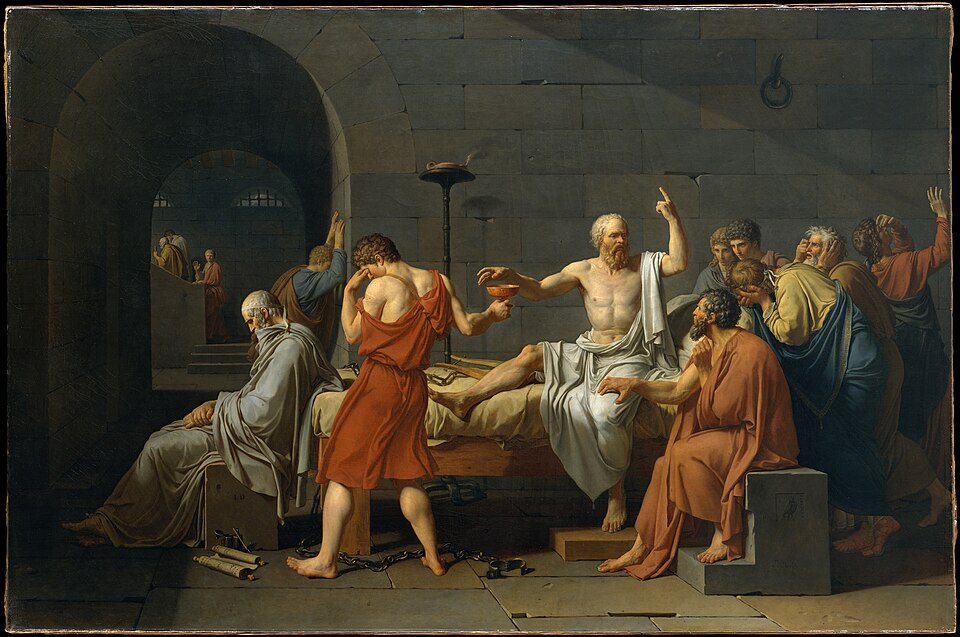

In the spring of 399 BC a young poet named **[Meletus](kloom:e/meletus)** summoned **[Socrates](kloom:e/socrates)**, an old man of **[Athens](kloom:e/athens)**, to answer a capital charge. Its sworn text, which the writer Favorinus, quoted by Diogenes Laertius, says was still kept in the city's archive in his day five centuries later, reads in R. D. Hicks's translation: "Socrates is guilty of refusing to recognize the gods recognized by the state, and of introducing other new divinities. He is also guilty of corrupting the youth. The penalty demanded is death." Socrates was about seventy. He had fought for Athens as a heavy infantryman, served once on its council, and spent his life in its streets and gymnasia asking people questions. **[Plato](kloom:e/plato)**'s dialogue _Euthyphro_ opens at the porch of the magistrate who would hear the case, where a friend is surprised to find Socrates so far from his usual haunt, the **[Lyceum](kloom:e/lyceum-classical)**, a gymnasium outside the walls.

## The trial

Athens had no public prosecutor. Meletus, joined by Anytus and Lycon, brought the case and argued it himself, and it went like this:

| Step        | What happened                                                                                 |
| ----------- | --------------------------------------------------------------------------------------------- |
| Summons     | Meletus delivered the charge before witnesses: appear before the king archon within four days |
| Hearing     | The archon accepted the case; the charge was posted on whitened boards in the agora           |
| Trial       | One day, each side timed by a water clock, before a jury of citizens chosen by lot            |
| First vote  | Guilty, by about 280 votes to 220                                                             |
| Penalty     | Meletus proposed death; Socrates, after a joke, offered a fine of thirty minae                |
| Second vote | Death, by a larger majority                                                                   |
| Execution   | Delayed about a month, until the sacred ship came back from Delos                             |

The jury was probably 500 or 501 men, though no source gives the number. In Plato's **[_Apology_](kloom:e/apology-plato)**, Socrates says, in Benjamin Jowett's translation of 1871, that he is only surprised the votes were so close: "had thirty votes gone over to the other side, I should have been acquitted." Diogenes adds that the death sentence passed "with an accession of eighty fresh votes": by our arithmetic, about 360 to 140. Between the votes Socrates first proposed, as his due, free meals at public expense, the honor of an Olympic victor. Then his friends, among them Plato, offered to stand surety for thirty minae.

## Questions in court

The _Apology_ shows his method at work on his accuser. Socrates asks Meletus who, if he corrupts the young, improves them:

> _Meletus:_ The laws.
>
> _Socrates:_ But that, my good sir, is not my meaning. I want to know who the person is, who, in the first place, knows the laws.
>
> _Meletus:_ The judges, Socrates, who are present in court. …
>
> _Socrates:_ Then every Athenian improves and elevates them; all with the exception of myself; and I alone am their corrupter? Is that what you affirm?
>
> _Meletus:_ That is what I stoutly affirm.

Then the counterexample: with horses it is the other way round, one trainer improves them and most people spoil them. This is the _elenchus_. Take the other man's claim, draw out what he must also believe, and let him find the two at odds. In the same speech Socrates calls himself a gadfly that God attached to the state, "a great and noble steed who is tardy in his motions", and says that "the unexamined life is not worth living".

## How we know

Socrates wrote nothing. Two men who knew him wrote _Apologies_, and they differ. Plato was in court. **[Xenophon](kloom:e/xenophon)** was away with an army in Asia, and took his account from a friend, Hermogenes; his Socrates speaks proudly because he has decided that death now is better than old age. Plato was not at the death either: the **[_Phaedo_](kloom:e/phaedo)** says he was ill. Its narrator tells how the man who brought the poison handed Socrates the cup, how he walked until his legs were heavy and lay down, the cold rising from his feet, and his last words: "Crito, I owe a cock to Asclepius; will you remember to pay the debt?" Historians have doubted that hemlock kills so quietly; others reply that the critics were reading of the wrong plant.

Jacques-Louis David painted it in 1787, and put an old Plato at the foot of the bed.

## Why Athens did it

Five years before, Athens had lost its long war with Sparta, and the Spartans set up the **[Thirty Tyrants](kloom:e/thirty-tyrants)**, who executed some 1,500 people without trial. Their leader, **[Critias](kloom:e/critias)**, had been one of Socrates' circle; **[Alcibiades](kloom:e/alcibiades)**, who had led Athens into its Sicilian disaster, another. Socrates refused the Thirty's order to fetch Leon of Salamis for execution, but stayed in the city. When democracy returned in 403 BC, an amnesty forbade prosecutions for what had been done under the Thirty, so, on one reading, a political charge could not be brought. In 392 BC the sophist Polycrates published a prosecution speech for Anytus that attacked what Socrates had done in politics before 403, and half a century after the trial the orator **[Aeschines](kloom:e/aeschines)** asked a jury, "Did you put to death Socrates the sophist, fellow citizens, because he was shown to have been the teacher of Critias, one of the Thirty who put down the democracy …" Others put religion first. Debra Nails and Sara Monoson, in the _Stanford Encyclopedia of Philosophy_, think the vote for death more likely came from jurors who feared the gods' anger if they spared a man already found impious.

Plato founded his **[Academy](kloom:e/platonic-academy)** around 387 BC. His pupil **[Aristotle](kloom:e/aristotle)** founded his own school in the Lyceum in 335 or 334 BC, and his **[_Politics_](kloom:e/politics-aristotle)** sorts constitutions, in Jowett's translation, by who rules and for whom:

| Rule by  | For the common interest   | Its perversion |
| -------- | ------------------------- | -------------- |
| One      | Kingship                  | Tyranny        |
| A few    | Aristocracy               | Oligarchy      |
| The many | Constitutional government | Democracy      |

Democracy, which had killed Socrates, is on the wrong side of the table. The next frame turns from the city to nature, and the questions Plato asked of it in the _Timaeus_.
