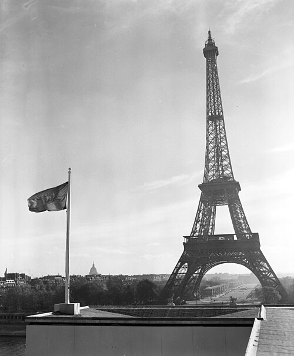

On 26 June 1945, at San Francisco, fifty nations signed the **[Charter of the United Nations](kloom:e/charter-of-the-united-nations)**. Its preamble promised "to reaffirm faith in fundamental human rights, in the dignity and worth of the human person, in the equal rights of men and women and of nations large and small", and its Article 68 told the new **[United Nations](kloom:e/united-nations)** to set up a commission "for the promotion of human rights". It did not say what the rights were. Three and a half years later, on 10 December 1948, the General Assembly meeting in **[Paris](kloom:e/paris)** adopted a list of them: the **[Universal Declaration of Human Rights](kloom:e/universal-declaration-of-human-rights)**. "The realization that the flagrant violation of human rights by Nazi and Fascist countries sowed the seeds of the last world war," the American delegate told the Assembly the day before, "has supplied the impetus for the work."

## How it was written

The Commission on Human Rights had eighteen members, and its chair was **[Eleanor Roosevelt](kloom:e/eleanor-roosevelt)**, Franklin Roosevelt's widow. In February 1947 she, **[P. C. Chang](kloom:e/p-c-chang)** of China and **[Charles Malik](kloom:e/charles-malik)** of Lebanon began work, and the UN Secretariat's human rights director, the Canadian lawyer **[John Peters Humphrey](kloom:e/john-peters-humphrey)**, wrote a preliminary draft. The French jurist **[René Cassin](kloom:e/rene-cassin)**, a Jew whom Vichy France had stripped of his citizenship and sentenced to death in his absence, recast it into the shape the Declaration still has. Which of the two was the first draft is disputed: the UN's own history credits Cassin with it and Humphrey with the "blueprint", while other accounts give Humphrey the first draft and Cassin the revision.

The arguments were real. Roosevelt remembered Chang, a Confucian and a pluralist, saying the Declaration "should reflect more than simply Western ideas", and Malik, a Lebanese Christian philosopher, answering at length with Thomas Aquinas. **[Hansa Mehta](kloom:e/hansa-mehta)** of India, one of two women on the Commission, is credited by the UN with changing "All men are born free and equal" to "All human beings". South Africa's delegate fought to strike out "dignity", which he feared would be turned against apartheid; Malik answered that South Africa's own prime minister, Jan Smuts, had put the word into the Charter.

The draft went through three bodies, each with a vote:

| Step                            | When                         | What happened                                                          |
| ------------------------------- | ---------------------------- | ---------------------------------------------------------------------- |
| Commission on Human Rights      | Geneva, 18 June 1948         | Approved, 12 for, none against, 4 abstaining                           |
| Third Committee of the Assembly | 30 September–7 December 1948 | 81 meetings on it, 168 proposed amendments; adopted 6 December, 29–0–7 |
| General Assembly                | Paris, 10 December 1948      | Adopted as resolution 217 A (III), 48–0–8                              |

The eight abstentions were the Soviet Union, the Byelorussian and Ukrainian republics, Czechoslovakia, Poland, Yugoslavia, Saudi Arabia and South Africa. Honduras and Yemen did not vote.

## What it says

Article 1 sets the ground: "All human beings are born free and equal in dignity and rights. They are endowed with reason and conscience and should act towards one another in a spirit of brotherhood." Article 3 is the shortest: "Everyone has the right to life, liberty and security of person." Cassin likened the whole to the portico of a Greek temple, and the plate draws his figure: the preamble's seven paragraphs are the steps, Articles 1 and 2 the foundation, four groups of articles the columns, and the last three the pediment that binds them.

| Part       | Articles | Kind of right                                                                          |
| ---------- | -------- | -------------------------------------------------------------------------------------- |
| Foundation | 1–2      | Dignity, liberty, equality, brotherhood; no distinction of any kind                    |
| Column 1   | 3–11     | The person: life, no slavery or torture, equality before the law, trial                |
| Column 2   | 12–17    | The person in society: privacy, movement, asylum, nationality, marriage, property      |
| Column 3   | 18–21    | Thought, conscience, religion, expression, assembly, a vote                            |
| Column 4   | 22–27    | Economic, social and cultural: social security, work, rest, health, education, culture |
| Pediment   | 28–30    | A social and international order, duties to the community, no abuse of the rights      |

## A declaration, not a treaty

Roosevelt said so plainly to the Assembly: "It is not a treaty; it is not an international agreement." Its preamble calls it "a common standard of achievement for all peoples and all nations". The law came after. The **[Genocide Convention](kloom:e/genocide-convention)**, adopted the day before, was a treaty. The **[European Convention on Human Rights](kloom:e/european-convention-on-human-rights)**, signed in Rome on 4 November 1950, gave rights a court, which has sat at Strasbourg since 1959 and hears individuals against their own states. The binding covenant the Commission had meant to write beside the Declaration split in two, by the Assembly's decision of 1952: one on civil and political rights, one on economic, social and cultural rights. Both were adopted in 1966 and came into force in 1976.

## Its reach and its critics

The split was the [Cold War](kloom:e/cold-war)'s. The Western states put civil and political rights first, freedoms a government must not violate; the Soviet bloc, which had abstained, put social and economic rights first, and Roosevelt thought its real objection was Article 13, the right to leave any country. Saudi Arabia abstained over the freedom "to change his religion" in Article 18 and over equal marriage in Article 16. Others objected to universality itself. The American Anthropological Association warned during the drafting that "standards and values are relative to the culture from which they derive"; the Cairo Declaration on Human Rights in Islam (1990) and the Bangkok Declaration (1993) later set out rights in their own terms. Even so, the Declaration has been translated into more languages than any other document, 562 by 2024, and by one scholar's count at least 90 constitutions written since 1948 draw on it.

The trail on the idea of rights begins at **[Magna Carta](kloom:e/magna-carta)**, and Roosevelt hoped this Declaration would "become the international Magna Carta of all men everywhere".
