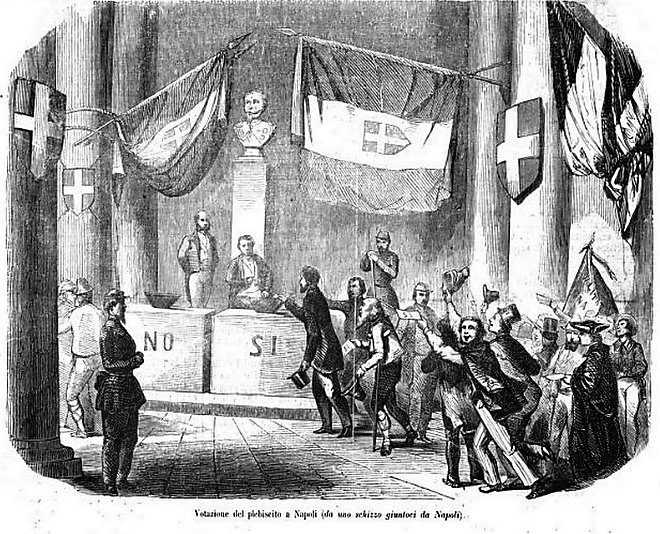

Between 1859 and 1871 two new states were made in the middle of Europe. The **[Kingdom of Italy](kloom:e/kingdom-of-italy)** was proclaimed on 17 March 1861, and the **[German Empire](kloom:e/german-empire)** in a palace outside Paris on 18 January 1871. Both were made by war, and both claimed to rest on something older: the nation. The **[unification of Italy](kloom:e/unification-of-italy)** and the **[unification of Germany](kloom:e/unification-of-germany)** turned an idea into a program, and the program into borders.

## The idea

The idea had German roots. **[Johann Gottfried Herder](kloom:e/johann-gottfried-herder)** held that a people is formed by its own language, songs and customs. He has often been classed as a German nationalist; the philosopher Michael Forster calls that "deeply misleading and unjust", since Herder valued every people equally and opposed conquest and colonial rule.

**[Giuseppe Mazzini](kloom:e/giuseppe-mazzini)** made a culture into a claim to a state. The society he founded in exile in 1831, Young Italy, opened its rules with it: "Young Italy is a brotherhood of Italians who believe in a law of Progress and Duty, and are convinced that Italy is destined to become one nation." Its Italy took in the islands "proved Italian by the language of the inhabitants". Mazzini wanted a republic; Italy got a kingdom, made by a minister.

## Italy by war and by vote

**[Camillo Benso, Count of Cavour](kloom:e/camillo-benso-count-of-cavour)**, prime minister of Piedmont-Sardinia, bought an ally: **[Napoleon III](kloom:e/napoleon-iii)** of France would fight Austria for him, and be paid in Nice and Savoy. Their armies beat the Austrians at the **[Battle of Solferino](kloom:e/battle-of-solferino)** on 24 June 1859, and Lombardy passed to Piedmont. In May 1860 **[Giuseppe Garibaldi](kloom:e/giuseppe-garibaldi)**, born in the Nice that Cavour had just given away, sailed from near Genoa with 1,089 volunteers, by one count. The **[Expedition of the Thousand](kloom:e/expedition-of-the-thousand)** landed at Marsala on 11 May, took Sicily, and entered Naples on 7 September. Then the conquest was put to a vote, on 21 October, with one question: did the people want "Italy one and indivisible with Victor Emmanuel as Constitutional King"?

A British admiral, Rodney Mundy, watched the voting in Naples:

| Step               | What Mundy saw                                                                                             |
| ------------------ | ---------------------------------------------------------------------------------------------------------- |
| Proof of the right | "Every man privileged to the franchise had first to produce his paper from the mayor"                      |
| The approach       | He went "through a file of the National Militia up a flight of steps to a platform"                        |
| The ballot         | Two urns painted "Si" and "No" stood apart from an empty one; he drew a card and dropped it in             |
| The watchers       | He walked to his urn "beneath the gaze of a dozen scrutators" and gave up his paper, so his name was known |

"It was, of course, open voting in the clearest sense of the word," Mundy wrote, and in an hour he saw three men take a "No". He concluded that such a plebiscite "cannot be received as a correct representation of the real feeling of a nation." The results, as the historian G. M. Trevelyan gave them in 1911:

| Region              | Yes       | No     |
| ------------------- | --------- | ------ |
| Neapolitan mainland | 1,302,064 | 10,312 |
| Sicily              | 432,053   | 667    |
| Marches             | 133,072   | 1,212  |
| Umbria              | 99,628    | 380    |

Trevelyan agreed that the real minority was "very much larger", but thought the vote "did not belie the opinion of the people". Venetia joined in 1866 and Rome in 1870, each by another near-unanimous vote: in Rome 133,681 to 1,507. Afterward Massimo d'Azeglio, once prime minister of Piedmont-Sardinia, wrote in his memoirs, in our translation: "Italy has been made, alas, but Italians are not being made." The tidier saying credited to him, "we have made Italy, now we must make Italians", is a later rewording, as the historian Stephanie Malia Hom has shown. He had reason. The linguist Tullio De Mauro estimated that in 1861 only 2.5 percent of Italians could speak standard Italian; Arrigo Castellani's later estimate was nearer 10 percent.

## Germany by iron and blood

**[Otto von Bismarck](kloom:e/otto-von-bismarck)** became prime minister of Prussia in September 1862 and told the budget committee that the great questions of the day would be decided "not by speeches and majority resolutions … but by iron and blood" (Jeremiah Riemer's translation). Three short wars followed: against Denmark in 1864, Austria in 1866 and France in 1870–71. The last began with a telegram from the spa at Ems, where on 13 July 1870 the king had politely refused a French demand. Bismarck cut the king's account down for the press:

| The king's account said                                    | Bismarck's version kept                                                    |
| ---------------------------------------------------------- | -------------------------------------------------------------------------- |
| The ambassador pressed "most insistently" on the promenade | The French demand, in full                                                 |
| The king refused, "somewhat severely"                      | "His Majesty the King thereupon refused to receive the French envoy again" |
| He was still awaiting news; the talks could go on          | Nothing                                                                    |

In his memoirs Bismarck boasted that the **[Ems dispatch](kloom:e/ems-dispatch)** would act as "a red rag upon the Gallic bull". France declared war on 19 July. Many historians, as Wikipedia summarizes them, think Napoleon III's government had already chosen war and that Bismarck's own telling enlarged his part.

On 18 January 1871 the Prussian king was proclaimed German Emperor in the **[Hall of Mirrors](kloom:e/hall-of-mirrors)** at Versailles, before princes and officers. The people were not asked; the princes had joined by treaty. By the peace of May 1871 France owed five billion francs and gave up most of Alsace and part of Lorraine.

## Those outside the nation

The peace of 1866 promised that North Schleswig would return to Denmark if its people asked "by a vote freely exercised". The vote was never held, and the clause was dropped in 1878. In 1905, by the _Encyclopaedia Britannica_'s count, 139,000 of the region's 148,000 people still spoke Danish, though German had replaced it "in the churches, the schools, and even in the playground". Prussia's Poles saw Polish pushed out of their schools and, from 1885, their land bought up for German settlers. In Italy the kingdom's first decade brought savage risings in Sicily and around Naples. In 1882 the French scholar **[Ernest Renan](kloom:e/ernest-renan)**, in our translation, called a nation's existence "a daily plebiscite", and denied that a nation has any right to say to a province, "You belong to me, I take you." He spoke eleven years after Alsace was taken without a vote. The treaty that ended the First World War was signed in the same Hall of Mirrors, in the frame on the Great War.
