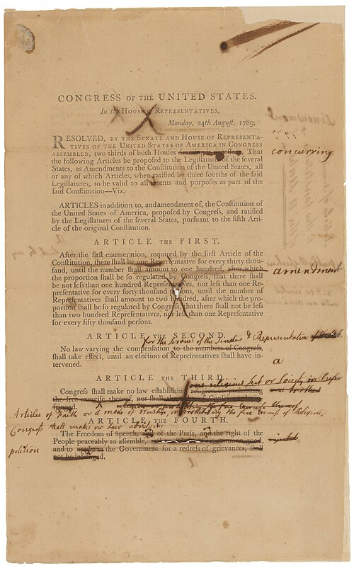

The **[Constitution of the United States](kloom:e/constitution-of-the-united-states)** that the Philadelphia Convention signed on 17 September 1787 set out a government's powers and said almost nothing about its citizens' rights. Five days earlier **[George Mason](kloom:e/george-mason)** of Virginia had asked for a bill of rights on the model of the states' own declarations, and the state delegations voted it down unanimously. Mason refused to sign. In the year of argument over ratification that followed, the **[Anti-Federalists](kloom:e/anti-federalists)** made the missing bill of rights their strongest charge, and the Federalists answered it. "Why declare that things shall not be done which there is no power to do?" **[Alexander Hamilton](kloom:e/alexander-hamilton)** asked in _The Federalist_ No. 84: a list of rights would only suggest that the government had powers it was never given. From Paris, **[Thomas Jefferson](kloom:e/thomas-jefferson)** told his friend **[James Madison](kloom:e/james-madison)** that "a bill of rights is what the people are entitled to against every government on earth".

Madison was slow to agree. In October 1788 he wrote to Jefferson that he had never thought the omission "a material defect", since experience showed that majorities in every state had trampled "these parchment barriers" whenever they stood in the way. But the Constitution was now ratified, Virginia's Anti-Federalists had drawn him a hostile district for the new Congress, and the legislatures of New York and Virginia were calling for a second general convention, which might undo the whole. In January 1789 he promised the voters of his district amendments for "all essential rights", won his seat, and kept the promise. What came of it is the **[Bill of Rights](kloom:e/united-states-bill-of-rights)**, the first ten amendments.

## Woven in, or added on

On 8 June 1789 Madison rose in the House. His proposals came as nine resolutions holding about twenty separate amendments, and he meant them to be written into the Constitution's own text: the religious and press freedoms were to go "in article 1st, section 9, between clauses 3 and 4". Written there, he argued, rights would be enforced by "independent tribunals of justice", which would be "an impenetrable bulwark against every assumption of power in the legislative or executive". Congress overruled him on the form, and then on part of the substance:

| When              | Who                                       | What came out                                                                         |
| ----------------- | ----------------------------------------- | ------------------------------------------------------------------------------------- |
| 8 June 1789       | Madison, in the House                     | Nine resolutions, about twenty amendments, each to be inserted into the text          |
| 24 August 1789    | The House, after Roger Sherman's motion   | Seventeen articles, set at the end of the Constitution so it would "remain inviolate" |
| 9 September 1789  | The Senate                                | Twelve articles; Madison's restraint on the states struck out                         |
| 25 September 1789 | Congress, after a conference              | Twelve articles, sent to the states on 2 October                                      |
| 15 December 1791  | Virginia, the eleventh of fourteen states | Articles three to twelve ratified: the ten amendments                                 |
| May 1992          | The thirty-eighth state                   | Article two, on congressional pay, ratified as the Twenty-seventh Amendment           |

The marked-up copy is the Senate's working text of September 1789. The clerks William Lambert and Benjamin Bankson then engrossed fourteen copies of the twelve articles on parchment, one for Congress and one for each of the thirteen states, and **[George Washington](kloom:e/george-washington)** sent them out. The first article, on the size of the House, has never been ratified.

## The ten

| Amendment | What it protects                                                                         |
| --------- | ---------------------------------------------------------------------------------------- |
| First     | Religion from establishment; worship, speech, the press, assembly and petition           |
| Second    | Keeping and bearing arms, tied to "a well regulated Militia"                             |
| Third     | Homes from soldiers quartered in them                                                    |
| Fourth    | Persons, houses and papers from unreasonable search; warrants only on probable cause     |
| Fifth     | Grand juries, no double jeopardy or forced self-incrimination, due process, compensation |
| Sixth     | A speedy public trial by jury, the charge, the witnesses, counsel                        |
| Seventh   | Juries in civil suits over twenty dollars                                                |
| Eighth    | No excessive bail or fines, no cruel and unusual punishment                              |
| Ninth     | Rights not listed are not thereby denied                                                 |
| Tenth     | Powers not delegated stay with the states or the people                                  |

The First and the Fourth, in the National Archives' transcription:

> Congress shall make no law respecting an establishment of religion, or prohibiting the free exercise thereof; or abridging the freedom of speech, or of the press; or the right of the people peaceably to assemble, and to petition the Government for a redress of grievances.
>
> The right of the people to be secure in their persons, houses, papers, and effects, against unreasonable searches and seizures, shall not be violated, and no Warrants shall issue, but upon probable cause, supported by Oath or affirmation, and particularly describing the place to be searched, and the persons or things to be seized.

The Ninth was Madison's answer to Hamilton: listing some rights was not to "deny or disparage others retained by the people".

## Old English words

Much of the language was old. Hamilton had dismissed bills of rights as bargains between kings and subjects: "Such was MAGNA CHARTA, obtained by the barons, sword in hand, from King John." But the Fifth Amendment's "due process of law" descends from **[Magna Carta](kloom:e/magna-carta)**'s "law of the land", by way of an English statute of 1354 that restated it as "due Process of the Law". The Eighth copies the **[Bill of Rights 1689](kloom:e/bill-of-rights-1689)** almost word for word: "excessive bail ought not to be required, nor excessive fines imposed, nor cruel and unusual punishments inflicted". The nearest model of all was Mason's own **[Virginia Declaration of Rights](kloom:e/virginia-declaration-of-rights)** of 1776.

## Whose rights

The amendments bound only the federal government. In 1833, in **[_Barron v. Baltimore_](kloom:e/barron-v-baltimore)**, Chief Justice John Marshall held that they "contain no expression indicating an intention to apply them to the State governments. This court cannot so apply them." They did nothing for the enslaved. In **[_Dred Scott v. Sandford_](kloom:e/dred-scott-v-sandford)** in 1857 the Supreme Court held that Black Americans could not be citizens, and turned the Fifth Amendment's due process clause into a shield for slaveholders' property in the territories. Only after the Civil War did the **[Fourteenth Amendment](kloom:e/fourteenth-amendment-to-the-united-states-constitution)**, ratified in 1868, forbid any state to "deprive any person of life, liberty, or property, without due process of law". Through it the Court began in 1925, with free speech in _Gitlow v. New York_, to apply most of the ten to the states, a process lawyers call incorporation.

The copy Congress kept, written in iron gall ink, is on show in the National Archives, sealed since 2003 in a case of titanium and aluminum filled with argon. The rights it lists were written by and for men. The next frame of this trail follows a woman who, the year after its ratification, demanded the same reason and the same rights for her sex: Mary Wollstonecraft.
