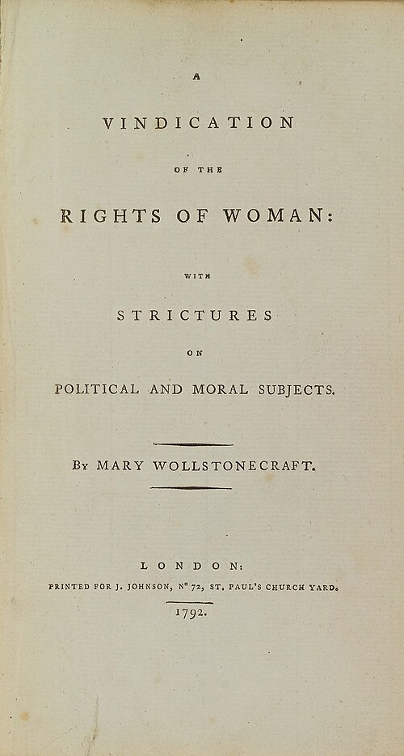

In January 1792 the London bookseller **[Joseph Johnson](kloom:e/joseph-johnson-publisher)** published a long, hurried, furious book by a woman of thirty-two: [_A Vindication of the Rights of Woman_](kloom:e/a-vindication-of-the-rights-of-woman), with Strictures on Political and Moral Subjects. Its author, **[Mary Wollstonecraft](kloom:e/mary-wollstonecraft)**, had been a lady's companion, a schoolmistress and a governess before she was a writer. In her mid-twenties she ran a school at Newington Green, outside London, with her sisters and her closest friend, Fanny Blood. After Fanny Blood died in 1785 she went to Ireland as governess to the daughters of the Kingsborough family, and after a year she left to live by her pen in London, where Johnson gave her translating and reviewing to do. Few women then supported themselves by writing.

## An answer to Burke

The book that made her name came first. In November 1790 **[Edmund Burke](kloom:e/edmund-burke)** published his [_Reflections on the Revolution in France_](kloom:e/reflections-on-the-revolution-in-france), mourning the French queen and the "age of chivalry", and on 29 November Johnson brought out the first of between fifty and seventy replies: [_A Vindication of the Rights of Men_](kloom:e/a-vindication-of-the-rights-of-men), anonymous. It attacked hereditary privilege, and Burke's sentiment for a queen at the expense of the hungry. The first edition sold out in three weeks, and the second carried her name. The _Critical Review_ then confessed that it "did not discover this Defender of the Rights of Man to be a Woman", and warned her that "if she assumes the disguise of a man, she must not be surprised that she is not treated with the civility and respect that she would have received in her own person."

## Until the age of eight

In September 1791 **[Talleyrand](kloom:e/charles-maurice-de-talleyrand-perigord)**, the former bishop of Autun, laid a plan for national education before France's National Assembly. Its primary schools were to be free and open to every child from the age of six. Girls were to be brought up at home, and the decree he proposed began, in our translation from the French: "Girls may be admitted to the primary schools only until the age of eight." Wollstonecraft dedicated her new book to him, "to induce you to read it with attention". It argues, in the 1792 text, like this:

| Step | The argument                                                 | In her words                                                                                                                                                       |
| ---- | ------------------------------------------------------------ | ------------------------------------------------------------------------------------------------------------------------------------------------------------------ |
| 1    | Virtue is the same for both sexes, because reason is         | "how can they, if virtue has only one eternal standard?"                                                                                                           |
| 2    | Women seem frivolous because they are brought up to be       | "Taught from their infancy, that beauty is woman's sceptre, the mind shapes itself to the body, and, roaming round its gilt cage, only seeks to adorn its prison." |
| 3    | Rousseau warns that educated women lose their power over men | "I do not wish them to have power over men; but over themselves."                                                                                                  |
| 4    | An uneducated wife and mother holds the nation back          | "if she be not prepared by education to become the companion of man, she will stop the progress of knowledge"                                                      |
| 5    | So educate them together, at public cost                     | "day schools for particular ages should be established by government, in which boys and girls might be educated together"                                          |

Her plan answered Talleyrand's age for age. Every child from five to nine would go to a free day school, "where boys and girls, the rich and poor, should meet together", dressed alike to prevent "the distinctions of vanity", to learn reading, writing, arithmetic, botany and astronomy, with games in the open air. After nine, children bound for trades and domestic work would go to one kind of school and the able or well-off to another, girls and boys still together. "Girls and boys still together? I hear some readers ask: yes." The plate draws the two plans side by side. In a footnote she admits that she borrowed "some hints" from Talleyrand's own pamphlet.

She went further in passing. Women "might certainly study the art of healing, and be physicians as well as nurses," or study politics, or run businesses. And, "I may excite laughter," she wrote, "for I really think that women ought to have representatives, instead of being arbitrarily governed without having any direct share allowed them in the deliberations of government."

## Read, then buried

The book was not, as is often said, received with hostility. The _Analytical Review_, the _Monthly Review_ and others praised it, a second edition followed within the year, American editions appeared, and it was translated into French. Then Wollstonecraft lived by her own lights. In France during the Terror she had a daughter, Fanny, by the American Gilbert Imlay, who left her; back in London she twice tried to kill herself. In 1797 she married the philosopher **[William Godwin](kloom:e/william-godwin)** when she was pregnant again, and she died of an infection on 10 September, eleven days after the birth of their daughter, **[Mary Shelley](kloom:e/mary-shelley)**, who would write _Frankenstein_.

In January 1798 Godwin published his [_Memoirs of the Author of A Vindication of the Rights of Woman_](kloom:e/memoirs-of-the-author-of-a-vindication-of-the-rights-of-woman), meaning to honor her. He told everything: the affairs, the child born outside marriage, the suicide attempts. The poet Robert Southey accused him of "stripping his dead wife naked"; a satire called _The Unsex'd Females_ cast her as Satan. Her reputation lay in ruins for most of a century, until the suffragist **[Millicent Garrett Fawcett](kloom:e/millicent-fawcett)** introduced a centenary edition in 1892 and claimed her for the vote.

## Two declarations

She was not alone. In September 1791, the month of Talleyrand's report, the playwright **[Olympe de Gouges](kloom:e/olympe-de-gouges)** had published in Paris a [_Declaration of the Rights of Woman and of the Female Citizen_](kloom:e/declaration-of-the-rights-of-woman-and-of-the-female-citizen), rewriting the Assembly's declaration of 1789 article by article. Her first article reads, in our translation, "Woman is born free and remains equal to man in rights," and her tenth: "woman has the right to mount the scaffold; she must equally have the right to mount the rostrum." The frame on the French Revolution tells what became of her. Wollstonecraft's book crossed the Atlantic, and the next frame of this trail follows the women who met at Seneca Falls in 1848 to claim the vote she had only hinted at.
