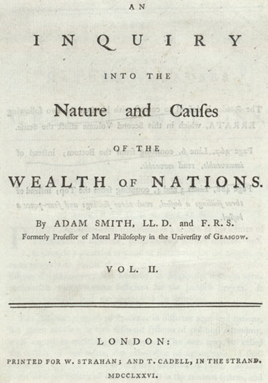

On 9 March 1776 the London booksellers William Strahan and Thomas Cadell published, in two volumes, _An Inquiry into the Nature and Causes of the Wealth of Nations_. Its author, **[Adam Smith](kloom:e/adam-smith)**, was fifty-two. Born in **[Kirkcaldy](kloom:e/kirkcaldy)**, a port across the Firth of Forth from Edinburgh, he had studied and then taught at the **[University of Glasgow](kloom:e/university-of-glasgow)**, where he held the chair of moral philosophy and where, from 1757, the young instrument maker James Watt had a workshop and became his friend. His first book, **[_The Theory of Moral Sentiments_](kloom:e/the-theory-of-moral-sentiments)** (1759), began from sympathy, our power to imagine ourselves in another's place. In 1764 he left Glasgow to tutor the young Duke of Buccleuch through France, met the French economists around François Quesnay in Paris, and in 1766 went home to Kirkcaldy, where he spent most of ten years on the new book. **[_The Wealth of Nations_](kloom:e/the-wealth-of-nations)** sold out its first edition in six months.

## Eighteen operations

It opens in a pin workshop. Pin-making, Smith says, is a "very trifling manufacture" but one in which the **[division of labor](kloom:e/division-of-labour)** has "very often" been noticed: a pin passes through "about eighteen distinct operations". The [_Encyclopédie_](kloom:e/encyclopedie)'s article on the pin had said the same in 1755: "a pin undergoes eighteen operations before it enters commerce" (our translation).

> One man draws out the wire; another straights it; a third cuts it; a fourth points it; a fifth grinds it at the top for receiving the head; to make the head requires two or three distinct operations; to put it on is a peculiar business; to whiten the pins is another; it is even a trade by itself to put them into the paper.

He had seen, he says, a small manufactory where ten men, poor and badly equipped, made about twelve pounds of pins a day. His arithmetic runs:

| Smith's figure                       | Pins a day                            |
| ------------------------------------ | ------------------------------------- |
| a pound of middling pins             | upwards of 4,000                      |
| ten men, working together, 12 pounds | upwards of 48,000                     |
| each man's share, a tenth            | 4,800                                 |
| one man alone, untrained             | "certainly" not 20, "perhaps not one" |

So one man in the shop did at least 240 times what he could do alone, and perhaps 4,800 times. Smith gives three causes: the "increase of dexterity in every particular workman", "the saving of the time which is commonly lost in passing from one species of work to another", and "the invention of a great number of machines" by men whose attention was fixed on one task. His nailers show the first:

| Worker                                  | Made in a day, by Smith                 |
| --------------------------------------- | --------------------------------------- |
| a common smith who has never made nails | "two or three hundred", "very bad ones" |
| a smith used to nails, but not a nailer | "eight hundred or a thousand"           |
| boys who have made nothing but nails    | "upwards of two thousand three hundred" |
| a pin-maker in the ten-man workshop     | 4,800 pins                              |

(The chart takes the middle of each of Smith's ranges.)

## The butcher and the invisible hand

Why do people divide their work at all? Because they trade. "It is not from the benevolence of the butcher, the brewer, or the baker that we expect our dinner, but from their regard to their own interest." The famous phrase comes once in the book, in Book IV, chapter 2, about a merchant who keeps his capital at home for his own security and so "is in this, as in many other cases, led by an **[invisible hand](kloom:e/invisible-hand)** to promote an end which was no part of his intention". Smith used it once in his first book too, about a landlord's harvest. Later economists made it a law of free markets; the historian Emma Rothschild has argued that Smith meant it ironically.

Smith did not trust merchants. "People of the same trade seldom meet together, even for merriment and diversion, but the conversation ends in a conspiracy against the public." His Book IV is an attack on the "mercantile system", **[mercantilism](kloom:e/mercantilism)**: tariffs, bounties, monopolies and colonies run for the benefit of merchants. The **[East India Company](kloom:e/east-india-company)** was his worst case. A shareholder's vote gave him "a share, though not in the plunder, yet in the appointment of the plunderers of India".

## What it cost

Smith saw what the division of labor did to the worker. A man who spends his life on a few simple operations "generally becomes as stupid and ignorant as it is possible for a human creature to become", and this, he said, is the fate of "the great body of the people, … unless government takes some pains to prevent it". His remedy was "a little school" in every parish, paid for partly by the public, as Scotland already had.

On slavery he argued as an economist: "the work done by slaves, though it appears to cost only their maintenance, is in the end the dearest of any." Why, then, did it last? "The pride of man makes him love to domineer," and sugar and tobacco could "afford the expense". In _The Theory of Moral Sentiments_ he had called the Africans enslaved by Europeans "nations of heroes" subjected "to the refuse of the jails of Europe".

He wrote as the American colonies rebelled. Britain's ban on their manufactures was "a manifest violation of the most sacred rights of mankind", and its empire in America "not an empire, but the project of an empire". In Smith's own year, 1776, Watt's first engines went to work. The next frame turns to the colonies, and to their own declaration.
