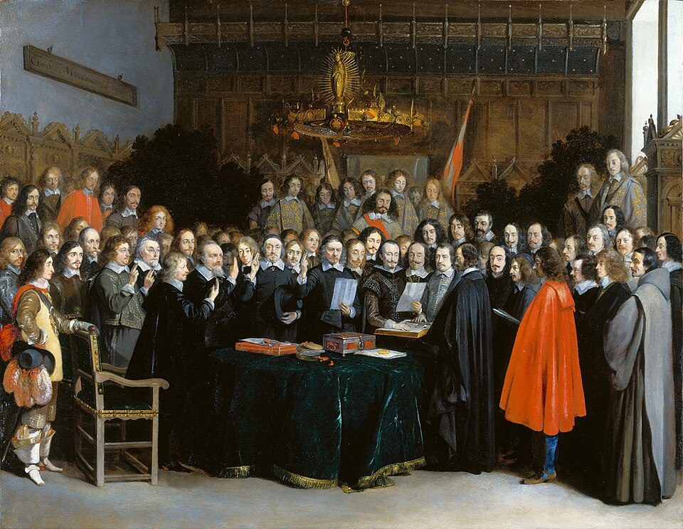

On 24 October 1648, in the Westphalian city of Münster, envoys of the emperor, of France and of Sweden, and deputies of the German princes, signed two treaties that ended the **[Thirty Years' War](kloom:e/thirty-years-war)**. Together they are the **[Peace of Westphalia](kloom:e/peace-of-westphalia)**. They had taken five years to write, in two towns at once, and until its end in 1806 they were part of the constitution of the **[Holy Roman Empire](kloom:e/holy-roman-empire)**, which had learned to live with two religions, and then three.

## Whose realm, his religion

The **[Reformation](kloom:e/reformation)** had split the Empire's princes between Catholicism and Lutheran **[Protestantism](kloom:e/protestantism)**, and after years of conflict the emperor **[Charles V](kloom:e/charles-v-holy-roman-emperor)** conceded, in the **[Peace of Augsburg](kloom:e/peace-of-augsburg)** of 1555, each prince the choice for his own lands, the principle summed up as **[_cuius regio, eius religio_](kloom:e/cuius-regio-eius-religio)**, "whose realm, his religion". Only Catholics and Lutherans were recognized; Calvinism was not, in its own name. In France there was no such settlement. On the night of 23–24 August 1572 King Charles IX ordered the killing of the leaders of the **[Huguenots](kloom:e/huguenots)**, the French Calvinists, gathered in Paris for a royal wedding, and Catholic mobs spread the slaughter through the city and then the provinces: the **[St. Bartholomew's Day massacre](kloom:e/st-bartholomews-day-massacre)**. Modern estimates of the dead run from 5,000 to 30,000. Pope Gregory XIII had a _Te Deum_ sung in thanksgiving. France's wars of religion ended only with the Edict of Nantes of 1598.

## Thirty years

The war began in Bohemia. Its king-elect, the Habsburg **[Ferdinand II](kloom:e/ferdinand-ii-holy-roman-emperor)**, was a champion of the Counter-Reformation; in 1598 he had ordered every Protestant preacher and teacher out of his lands in Inner Austria, a purge that sent the Lutheran **[Johannes Kepler](kloom:e/johannes-kepler)**, then teaching at Graz, looking for work in Prague. On 23 May 1618 Bohemia's Protestant nobles, fearing for their rights, threw two royal regents and their secretary from a window of Prague Castle, about twenty meters up: the **[Defenestration of Prague](kloom:e/defenestrations-of-prague)**. All three survived. The revolt became a war between Catholic and Protestant princes, and then a war of the powers, as Denmark, Sweden and at last Catholic France joined the fight against the Habsburgs. Kepler, now the emperor's mathematician at Linz, saw the Bavarian army enter the town in 1620, and in 1626 a siege of the town burned the shop printing his astronomical tables.

Armies of mercenaries lived off the land, and plague, typhus, dysentery and hunger followed them. How many died is still argued over. In 1940 the historian Günther Franz estimated that the German lands lost about 40 percent of their rural people and a third of their townspeople; English-language writers, following his critics, long gave "15 or 20 percent". Quentin Outram, reviewing studies of parish registers, concluded in 2001 that they confirm a mortality crisis of the order Franz described, though his figures also count those who fled and the children never born. Total deaths are now put at 4.5 to 8 million.

## Two towns

The powers agreed at Hamburg in December 1641 to meet in two towns, about 46 kilometers apart by our arithmetic, and to demilitarize both towns and the roads between them. Splitting the congress kept France and Sweden from quarreling over rank, and spared the pope's envoy from sitting with Protestants.

| Town      | Who negotiated                               | How                                                |
| --------- | -------------------------------------------- | -------------------------------------------------- |
| Münster   | The emperor and France; Spain and the Dutch  | Through mediators, the papal nuncio and a Venetian |
| Osnabrück | The emperor, Sweden and the Empire's estates | Face to face                                       |

The envoys began arriving in 1643, but quarrels over rank and titles held up the real negotiations until June 1645. About 109 delegations came, from 16 European states and speaking for some 140 of the Empire's own, and they never met all together. The treaties were signed on the same day. After its promise of peace, the treaty with France begins with forgetting: its Article II, in the English of the Avalon Project, promises "a perpetual Oblivion, Amnesty, or Pardon of all that has been committed since the beginning of these Troubles".

Calvinists were recognized beside Catholics and Lutherans, and church property and the right to worship were fixed as they had stood on 1 January 1624. Rulers could no longer compel their subjects' private worship. Sweden took Western Pomerania and five million thalers; France kept Metz, Toul and Verdun and gained ground in Alsace. The Swiss cantons were declared "in possession of their full Liberty and Exemption of the Empire". Spain made its own peace with the **[Dutch Republic](kloom:e/dutch-republic)**, recognizing its independence, sworn at Münster on 15 May 1648, the moment in Gerard ter Borch's painting; some historians count it part of the Peace of Westphalia and some do not. Pope Innocent X condemned the settlement as "null, void, invalid, iniquitous, unjust, damnable".

## A myth of sovereignty

Scholars of international relations long taught that Westphalia founded the modern order of sovereign states, which they call **[Westphalian sovereignty](kloom:e/westphalian-system)**. Most historians now call that the "Westphalian myth". The political scientist Andreas Osiander argued in 2001 that the treaties confirm neither France's sovereignty nor anyone else's, and say nothing of sovereignty as a principle. They held the Empire together, with France and Sweden as guarantors of its constitution, and the princes could make alliances only so long as they were "not against the Emperor, and the Empire". What the peace did establish, inside the Empire, was a legal order shared by three confessions, whose quarrels went to court rather than to war: half the judges of the Imperial Chamber Court were to be Protestant. The case for tolerating each person's conscience was made four decades later, by John Locke among others, in the frame after the Royal Society's.
