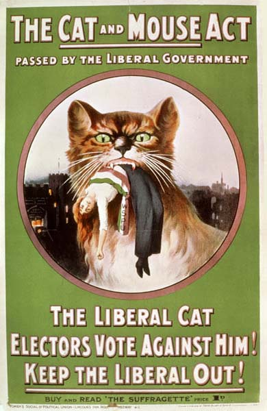

On 19 and 20 July 1848 about three hundred people crowded into the Wesleyan Chapel at **[Seneca Falls](kloom:e/seneca-falls-convention)**, in upstate New York, for the first convention on "the social, civil, and religious condition and rights of woman". It was called by **[Elizabeth Cady Stanton](kloom:e/elizabeth-cady-stanton)** and **[Lucretia Mott](kloom:e/lucretia-mott)**, who had met in 1840 in London, where a world antislavery convention refused to seat women delegates, and by a few Quaker women of the district. Stanton had written its manifesto, the **[Declaration of Sentiments](kloom:e/declaration-of-sentiments)**, on the model of the Declaration of Independence:

> We hold these truths to be self-evident; that all men and women are created equal; that they are endowed by their Creator with certain inalienable rights; that among these are life, liberty, and the pursuit of happiness …
>
> The history of mankind is a history of repeated injuries and usurpations on the part of man toward woman, having in direct object the establishment of an absolute tyranny over her.

Where Jefferson had listed the king's wrongs, Stanton listed man's, and the first was this: "He has never permitted her to exercise her inalienable right to the elective franchise." The resolutions followed. Only the ninth, that women should "secure to themselves their sacred right to the elective franchise", was seriously opposed. Mott feared it would make them ridiculous. **[Frederick Douglass](kloom:e/frederick-douglass)**, who had escaped slavery and was the only Black person at the meeting, spoke for it. It is often said to have passed narrowly; the convention's own report says only that, after debate, the resolutions passed "by a large majority". A hundred people signed, 68 women and 32 men. A week later Douglass's paper, the _North Star_, whose motto was "Right is of no Sex", declared: "We hold woman to be justly entitled to all we claim for man."

## How the vote was won

**[Women's suffrage](kloom:e/womens-suffrage)** took seventy-two years in the United States, and longer elsewhere. Each country got there by its own road, and many first let only some women in:

| Year | Where                 | Who could vote, and how it was won                                                                                                                   |
| ---- | --------------------- | ---------------------------------------------------------------------------------------------------------------------------------------------------- |
| 1893 | New Zealand           | All women of 21 and over, Māori and Pākehā; a petition of nearly 32,000 signatures, and an upper house that passed the bill 20 to 18                 |
| 1906 | Finland               | All women, to vote and to stand, in a grand duchy of the Russian Empire; nineteen were elected to its parliament in 1907                             |
| 1913 | Norway                | All women, by a unanimous vote of the Storting, after middle-class women won the vote in 1907                                                        |
| 1918 | United Kingdom        | Women over thirty with a property qualification, 8.4 million of them; men voted at twenty-one                                                        |
| 1920 | United States         | The Nineteenth Amendment, ratified when Tennessee's House voted for it with 50 of 99 members                                                         |
| 1928 | United Kingdom        | All women at twenty-one, five million more                                                                                                           |
| 1944 | France                | An ordinance of de Gaulle's committee in Algiers, after the Senate had refused, between the wars, to take up the Chamber's bills; first used in 1945 |
| 1971 | Switzerland (federal) | A referendum of the men, who had voted it down in 1959; the last canton gave way to a federal court in 1990                                          |

The chart counts, by our arithmetic, the years from Seneca Falls to each of those votes.

## Petitions, windows and hunger

New Zealand's campaign was led by **[Kate Sheppard](kloom:e/kate-sheppard)** and the Women's Christian Temperance Union, who wanted the vote partly to curb drink. They petitioned Parliament three years running, with more than 9,000 signatures in 1891, almost 20,000 in 1892 and nearly 32,000 in 1893, close to a quarter of the colony's adult European women. Britain's movement split. The National Union of Women's Suffrage Societies, led by Millicent Fawcett, kept within the law. **[Emmeline Pankhurst](kloom:e/emmeline-pankhurst)** founded the **[Women's Social and Political Union](kloom:e/womens-social-and-political-union)** in Manchester in October 1903 under the motto "deeds, not words", and its members, mocked in 1906 by the _Daily Mail_ as "suffragettes", took the name. They heckled ministers and smashed windows, and later burned postboxes and buildings and set bombs; the arson campaign killed at least five people.

Jailed, they went on hunger strike, and the prisons force-fed them through a tube. In April 1913 Parliament answered with the Prisoners (Temporary Discharge for Ill-Health) Act, which the suffragettes called the **[Cat and Mouse Act](kloom:e/prisoners-temporary-discharge-for-ill-health-act-1913)**. The plate draws its cycle: a striker was let out when she grew too weak, given a set time to recover, and taken back to serve the rest of her sentence, the days outside not counting. **[Emily Wilding Davison](kloom:e/emily-davison)**, arrested nine times and force-fed forty-nine, walked onto the course at the Derby on 4 June 1913, was struck by the king's horse and died four days later; whether she meant to die, or only to fix the suffragette colors to the horse, is not known. Historians still differ on whether militancy helped the cause or, after 1912, held it back.

## Who was left out

The movement had its own exclusions. When the Fifteenth Amendment of 1870 promised the vote regardless of race, Stanton and **[Susan B. Anthony](kloom:e/susan-b-anthony)** broke with old allies, saying Black men should not be enfranchised before white women. At the great suffrage parade in Washington on 3 March 1913, the journalist **[Ida B. Wells](kloom:e/ida-b-wells)** was told to leave the Illinois delegation for a segregated section at the back; she rejoined her state's women as they marched. The [Nineteenth Amendment](kloom:e/nineteenth-amendment-to-the-united-states-constitution) changed the law, not the South: poll taxes, literacy tests and violence kept most Black women from voting there until the Voting Rights Act of 1965. Australia's women won the federal vote in 1902, except Aboriginal women. In Boston, **[Mary Eliza Mahoney](kloom:e/mary-eliza-mahoney)**, the first African American woman to finish a course of training as a nurse in the United States, was among the first women in the city to register in 1920.

At Runnymede in 1215 the king made his promises to "free men", and the trail began there. Its last step comes in 1948, when the Universal Declaration of Human Rights wrote that elections "shall be by universal and equal suffrage".
